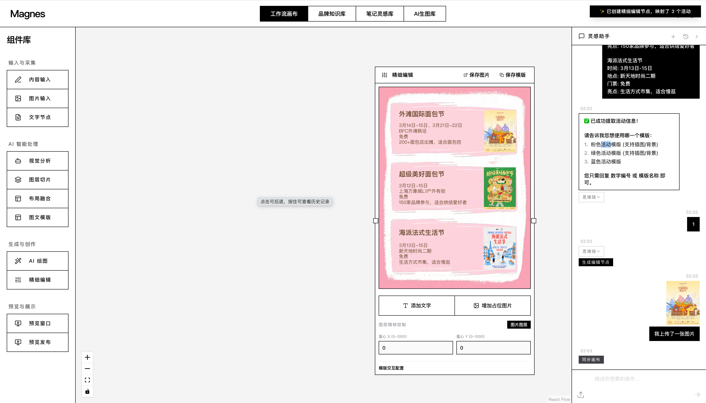
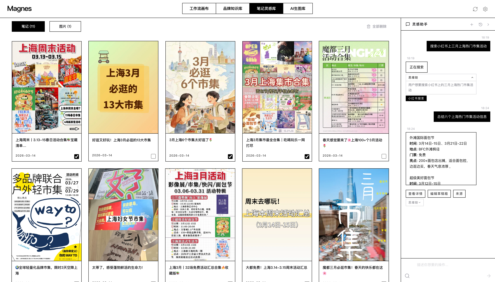
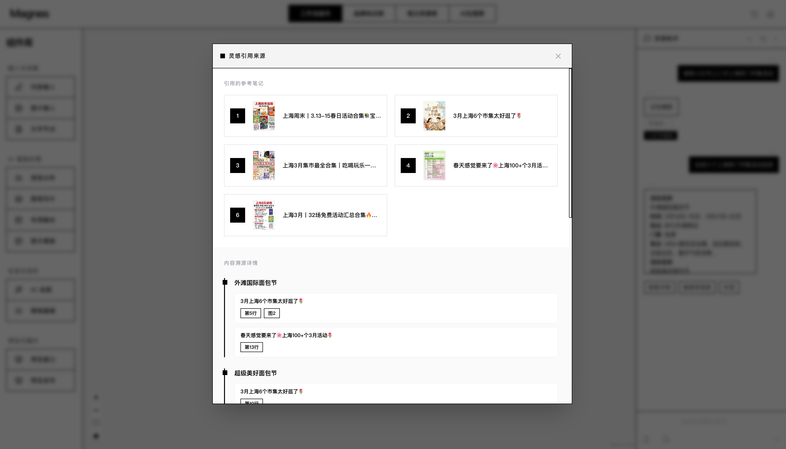
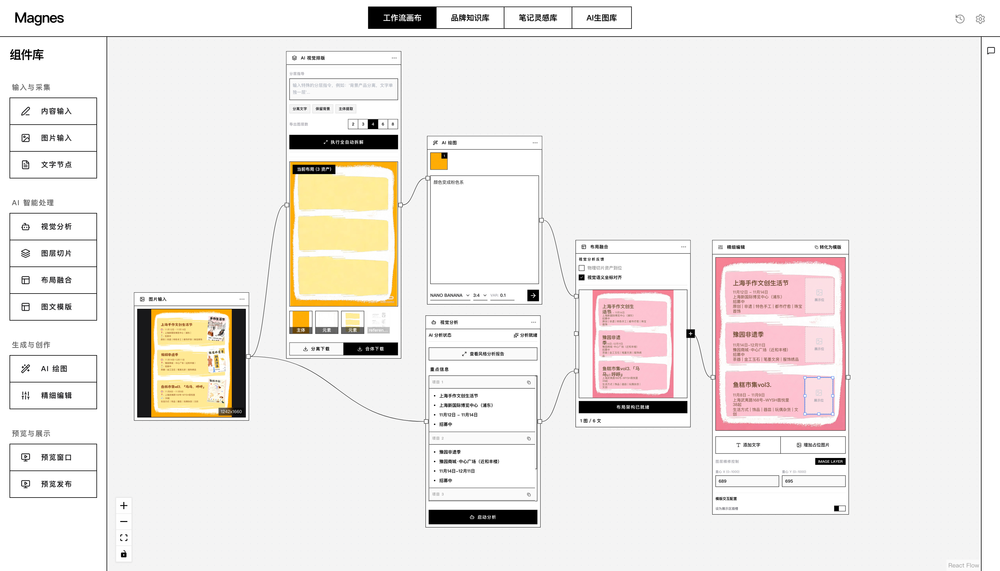
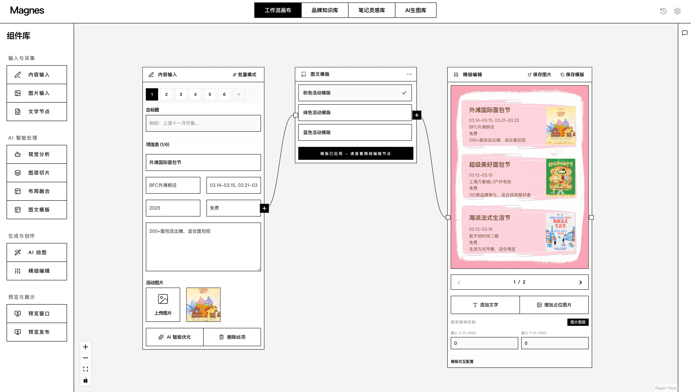
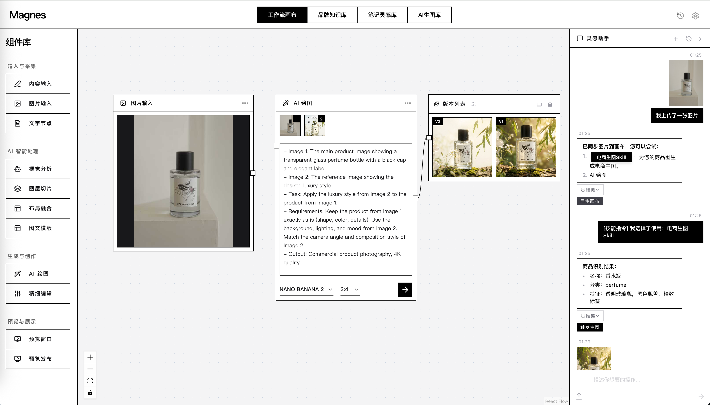
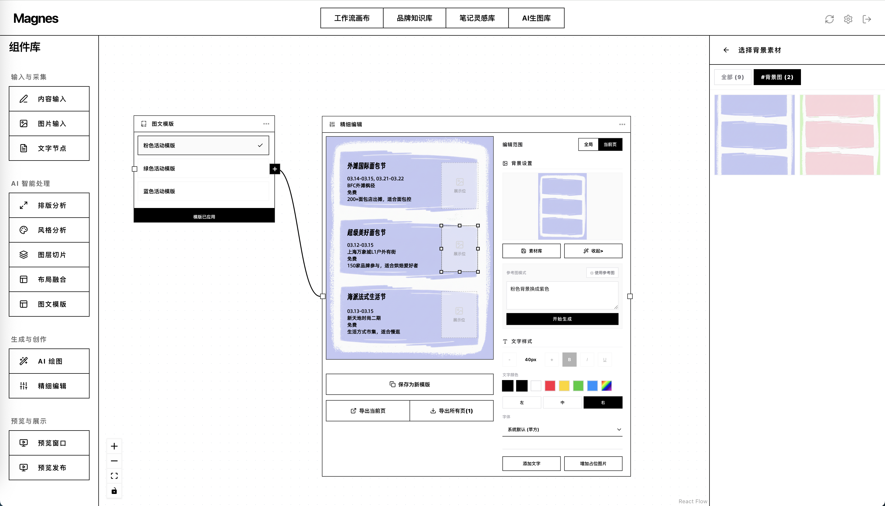
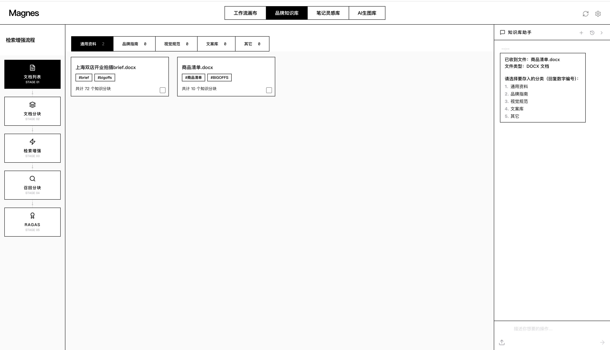
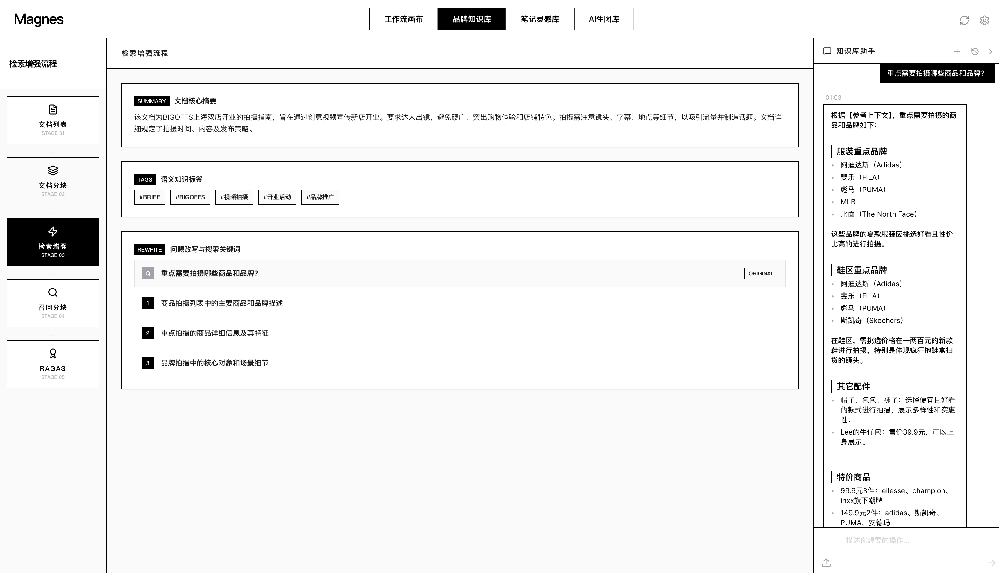
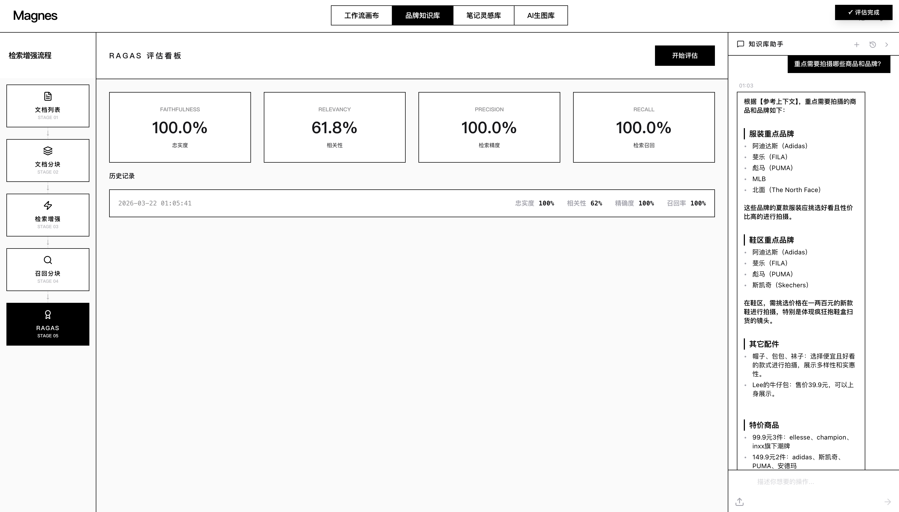

<div align="center">

# Magnes

面向小红书、电商和品牌内容团队的 AI 内容生产工作台。

从灵感搜索、知识检索、对话规划、批量生成、精细编排，到可复用技能沉淀。

[](LICENSE)
[](https://python.org)
[](https://fastapi.tiangolo.com)
[](https://langchain-ai.github.io/langgraph/)
[](https://react.dev)

</div>

---

## 项目定位

Magnes 是一个以可视化画布为中心的 AI 内容生产系统。它把对话助手、RAG 知识库、长短期记忆、自我迭代技能库、批量图文生成和精细编排放在同一个工作台里。

它为小红书内容创作者、品牌电商运营团队和内容工作室提供 AI 驱动的图文内容生产工作台。

Magnes 解决的核心问题不是“生成一张图”，而是把“搜索灵感、理解资料、组织内容、选择模板、批量生成、精修导出、沉淀技能”串成一个可追溯、可复用、可迭代的生产流程。

---

## 核心亮点

### Manager-Worker 中心化多智能体架构

Magnes 的智能体系统不是单个大模型直接处理所有任务，而是基于 LangGraph 构建的 Manager-Worker 中心化多智能体架构。`Supervisor / Planner Agent` 作为 Manager，负责理解用户意图、读取记忆和技能上下文、生成结构化 action，再把任务分发给专业 Worker。

核心智能体：

| 智能体 | 代码位置 | 主要职责 |
| --- | --- | --- |
| Supervisor / Planner Agent | `backend/app/agents/planner/router.py` | 统一意图识别、技能召回、参数抽取、路由决策 |
| Designer Agent | `backend/app/agents/designer_agent.py` | 处理 AI 生图、图片重绘、电商商品图、提示词优化、图片上下文恢复 |
| Creative Agent | `backend/app/agents/creative_agent.py` | 处理小红书搜索、灵感分析、活动总结、文案生成、图文模板内容准备 |
| Knowledge Agent | `backend/app/agents/knowledge_agent.py` | 调用 RAG 检索品牌知识库，回答文档、品牌规范和业务资料相关问题 |

支撑节点和工具层：

| 节点/工具 | 代码位置 | 主要职责 |
| --- | --- | --- |
| Executor | `backend/app/agents/planner/executor.py` | 执行物理工具调用，例如生图 API、图片尺寸映射和结果回写 |
| Summarizer | `backend/app/agents/planner/summarizer.py` | 根据 token、任务阶段、工具链完成和项目/技能切换压缩长会话 |
| Security Check | `backend/app/tools/security_check.py` | 对文本结果做敏感词和合规检查 |

协作方式：

1. 用户在对话框输入需求，前端把消息、画布上下文、当前图片、选中素材、`activeSkill` 等信息传给后端。
2. Planner Graph 从 `planner_agent` 开始执行，Supervisor 读取长期记忆、短期摘要、技能信息和最近消息。
3. Supervisor 输出标准 JSON action，例如 `run_painter`、`run_xhs_search`、`analyze_inspiration`、`run_knowledge_agent`、`create_rednote_node`。
4. `routing.py` 根据 action 把任务分发到 Designer、Creative、Knowledge 或 Security Check。
5. Worker 智能体只处理自己领域内的参数补全和业务推理，减少单个 Prompt 过大导致的串场。
6. 专家节点完成后统一进入 Executor，执行需要落地的工具调用。
7. Summarizer 在合适边界压缩会话，把关键状态写回 `ConversationSummary`，保证长任务继续稳定执行。
8. LangGraph checkpoint 使用 SQLite 保存 Planner 状态，支持按用户、项目和 conversation 维度恢复上下文。

视觉生成工作流还有一层专家流水线，位于 `backend/app/core/workflow.py`：

| 专家节点 | 代码位置 | 作用 |
| --- | --- | --- |
| Slicer | `backend/app/tools/slicer.py` | 前置图层拆解和图像分层 |
| Layout Analyzer | `backend/app/agents/experts/layout_analyzer.py` | 分析版式结构、元素位置和排版关系 |
| Style Analyzer | `backend/app/agents/experts/style_analyzer.py` | 提取视觉风格、色彩、字体和设计语言 |
| Style Evolve | `backend/app/agents/experts/style_evolve.py` | 演化和优化生成提示词 |
| Painter | `backend/app/agents/experts/painter.py` | 调用图像生成模型生成图片 |
| Style Critic | `backend/app/agents/experts/style_critic.py` | 对生成结果做视觉评分和审计 |
| Composer | `backend/app/tools/composer.py` | 汇合图层、生成结果和分析信息 |
| Reviewer | `backend/app/tools/reviewer.py` | 最终审美审核和结果整理 |

这套设计让 Magnes 可以同时处理“对话规划”和“视觉生产”两类复杂任务：上层 Manager 决定做什么，Worker 专家完成领域推理，执行层和视觉专家流水线负责把结果落地。

### 长短期记忆系统

Magnes 不把所有历史对话粗暴塞进提示词，而是把记忆拆成不同层级。

| 记忆层 | 实现 | 作用 |
| --- | --- | --- |
| 长期偏好 | `Soul.md` / `user_memories(memory_type="soul")` | 记录用户或品牌稳定偏好、风格、约束和禁忌 |
| 中期记忆 | `MEMORY.md` / `user_memories(memory_type="memory")` | 记录常用模板、已确认决策、工作流经验 |
| 结构化记忆 | `UserMemory` 的 `preference`、`rejection`、`workflow`、`style` 等类型 | 机器可读的偏好和工作流信号 |
| 短期会话记忆 | `ConversationSummary` | 压缩长会话，同时保留当前任务状态 |
| 行为事件记忆 | `MemoryEvent`、`TaskTrace`、`CanvasActionLog` | 为记忆回流和技能迭代提供证据 |

当前压缩机制：

- 优先按 token 估算触发，而不是只按消息条数。
- 支持软阈值、硬阈值和消息数兜底阈值。
- 工具链完成、任务阶段完成、项目切换、技能切换会作为弱触发。
- 压缩后保留最近原始消息，并把旧上下文写入 `conversation_summaries`。
- 摘要保留用户目标、已确认选择、模板、工具结果、失败点、画布节点、当前项目、当前技能和下一步任务。

这样可以让 Planner 规划器在长会话里保持上下文稳定，同时避免旧工具日志和重复对话污染推理。

### 自我迭代技能库

Magnes 的技能不是固定写死的脚本，而是用户可以从自己的流程里生成、启用、使用、再迭代的工作流资产。

技能生命周期：

1. 用户在画布上完成一次有价值的流程。
2. 点击“保存为技能草稿”。
3. 系统根据画布节点、连线、项目上下文和最近 `TaskTrace` 生成 `SkillCandidate`。
4. 用户在技能库里编辑草稿名称、触发方式、步骤和 `SKILL.md`。
5. 启用草稿后，系统写入 `.agent/skills/user-generated/*/SKILL.md` 和 `skill.json`。
6. 后续用户可以在技能库显式使用，也可以通过自然语言自动召回。
7. 每次执行记录 `SkillRun`。
8. 失败、用户纠正、重复修改会形成 `SkillFeedbackEvent`。
9. 系统生成 `SkillPatchProposal`，用户确认后更新 `SKILL.md`、`skill.json`、`CHANGELOG.md` 和版本号。

目标是让“做过一次的复杂流程”变成“下次能直接复用并持续变好的技能”。

### 面向生产的 RAG 知识库

Magnes 的 RAG 不是简单向量检索，而是面向品牌简报、活动方案、商品表格、PDF、Word、Excel、图片素材和小红书笔记做了完整处理。

RAG 关键能力来自 `backend/app/rag/`：

- 支持 PDF、DOCX、XLSX、HTML、Markdown、URL、手动文本、图库图片、小红书笔记入库。
- 文档解析阶段生成文档核心摘要和语义标签，并写入分块元数据。
- 摘要或标签生成失败时，会使用文件名、标题和正文片段兜底，避免“已入库但无摘要/标签”。
- 父子分块：父块保留完整语境，子块保留更细事实。
- 命题提取：把密集简报、表格、列表拆成可检索的原子事实。
- 混合语义切分：HTML/Markdown 走结构解析，PDF/Word 走章节路由，超长段落走窗口切分。
- 表格保护：表格会转为 Markdown table，减少结构丢失。
- 文档内图片抽取：图片保存到本地，并融合视觉模型描述和 OCR 原文，让视觉信息也能被检索。
- ChromaDB 向量检索 + BM25 关键词检索，中文关键词使用 Jieba 分词。
- QueryFusionRetriever + RRF 融合排序。
- BM25 检索器缓存，提升重复检索速度。
- 缺少 LlamaIndex BM25 插件时可降级到 `rank-bm25`。
- 支持按用户、来源、分类、选中文档 ID 做元数据过滤。
- 小块回溯到大块：命中子分块时可回到父分块，避免只看到碎片。
- 查询改写：结合文档摘要和标签改写查询，提升召回覆盖。
- LLM 重排：对候选片段做二次打分，并用动态阈值过滤低质量结果。
- RAGAS 评估：支持忠实度、答案相关性、上下文精确率、上下文召回率评测。

它带来的实际效果：

- 能针对品牌简报做可靠问答。
- 能总结选中的小红书灵感笔记，并保留来源溯源。
- 能把上传文档转成可用于文案、设计和工作流规划的上下文。
- 能在前端看到文档摘要、语义标签、分块和召回结果。
- 能用 RAGAS 评估检索质量，而不是只凭感觉调参。

### 批量生成和精细编排

Magnes 面向的是一组内容的生产，而不是单张图的偶然生成。

- 一份活动清单可以生成多页小红书信息图。
- 一个图文模板可以批量套用到多个活动、商品或内容条目。
- 支持分页预览、模板选择、画布节点生成。
- 支持精细编排节点做文字、图层、背景、颜色、布局微调。
- 支持前端 DOM 导出和后端 Playwright 导出高清 PNG。

这适合活动合集、市集/展览攻略、商品合集、品牌营销活动多版本素材。

## 功能总览

| 模块 | 能力 |
| --- | --- |
| 多智能体 Planner | Manager-Worker 中心化路由、专家分工、SSE 流式响应、记忆注入、activeSkill 注入 |
| 可视化画布 | ReactFlow 节点、连线、项目自动保存、多项目管理 |
| 小红书灵感库 | 搜索笔记、基础信息即时入库、详情增强、活动总结、来源溯源 |
| 知识库 | 文档上传、摘要标签、分块预览、混合检索、RAG 问答 |
| RAG 检索 | 向量 + BM25 + RRF + 查询改写 + LLM 重排 + 文档过滤 |
| 批量图文生成 | 结构化内容转多页图文、模板选择、画布节点创建 |
| 精细编排 | 图层编辑、背景替换、文字样式、分页、高分辨率导出 |
| 技能库 | 技能草稿、已启用技能、`SKILL.md`、manifest 召回规则、补丁建议 |
| 记忆系统 | `Soul.md`、`MEMORY.md`、`ConversationSummary`、`MemoryEvent`、`TaskTrace`、`UserMemory` |
| 电商技能 | 商品图片上传、商品识别、电商主图提示词和生图流程 |
| 项目持久化 | 自动保存 nodes/edges/viewport、恢复最近项目、软删除、快照 |

## 典型工作流

### 小红书活动合集

```text
搜索小红书上海五月热门市集，总结9个，粉色风格模版
```

Magnes 可以执行：

1. 搜索小红书。
2. 将搜索结果基础信息即时同步到灵感库，并按配置补充详情增强。
3. 按用户指定数量生成活动合集草稿。
4. 为每个活动保留来源溯源。
5. 用户确认后选择模板。
6. 创建内容输入、模板选择、精细编排节点。
7. 导出多页小红书信息图。

### 品牌简报问答

```text
根据我上传的 BIGOFFS 开业简报，总结达人拍摄必须包含哪些内容
```

Magnes 可以执行：

1. 解析 PDF / DOCX / XLSX。
2. 提取摘要、标签、表格、图片、OCR 原文和视觉描述。
3. 使用向量 + BM25 混合检索。
4. 根据文档摘要和标签改写查询。
5. 使用 LLM 对候选片段重排。
6. 返回带相关分块依据的答案。

### 画布流程沉淀为技能

```text
用户完成一套可复用画布工作流后，点击保存为技能草稿。
```

Magnes 可以执行：

1. 保存当前画布为技能草稿。
2. 合并画布节点步骤和最近对话 trace。
3. 生成草稿 `SKILL.md`。
4. 启用后写入 `.agent/skills/user-generated`。
5. 后续通过普通对话或技能库显式选择召回。
6. 根据失败和用户纠正提出技能更新建议。

---

## 重点截图

### 对话驱动画布工作流

用户可以直接用自然语言描述需求，Planner 规划器会创建对应的画布节点和后续流程。



### 小红书灵感搜索与来源溯源

搜索真实小红书笔记，基础信息即时同步入灵感库；后续总结活动时可以看到引用来源。





### 模板工作流和批量生成

结构化内容连接模板节点后，可以生成多页图文内容，并继续进入精细编排。





### AI 生图和电商技能

上传商品图后可以触发电商生图技能，识别商品并生成商业主图提示词和结果。



### 精细编排

在精细编排节点里继续调整图层、文字、背景和分页效果。



### RAG 知识库

文档入库后会生成摘要、标签、父子分块、图片分块，并支持检索增强和 RAGAS 评测。







---

## 项目结构

```text
magnes/
├── backend/
│   ├── main.py
│   └── app/
│       ├── agents/          # Planner 规划器、创作、设计、知识工作流
│       ├── api/             # FastAPI 路由
│       ├── memory/          # 记忆、轨迹、技能数据模型
│       ├── rag/             # 解析、分块、向量库、检索、重排、评测
│       ├── skills/          # 内置技能支持
│       ├── tools/           # 图片、OCR、小红书和工作流工具
│       └── core/            # LLM 配置、数据库、鉴权、存储
├── frontend/
│   ├── index.html
│   ├── src/
│   └── js/compiled/
├── .agent/skills/           # 内置和用户生成的可执行技能
├── assets/screenshots/      # README 截图
├── specs/                   # 产品、架构、数据、流程、部署文档
└── README.md
```

---

## 快速开始

### 环境要求

- Python 3.10+
- Node.js 18+，仅在修改 `frontend/src` 后需要重新编译前端
- OpenAI 兼容 LLM 接口
- Playwright Chromium，用于服务端截图导出

### 安装

```bash
git clone https://github.com/tianfeicoding/magnes.git
cd magnes

cd backend
python -m venv .venv
.venv/bin/pip install -r requirements.txt
.venv/bin/playwright install chromium
```

如果 RAG 报缺少 LlamaIndex 插件，可以单独补装：

```bash
.venv/bin/pip install llama-index-vector-stores-chroma llama-index-retrievers-bm25
```

### 配置

```bash
cp backend/.env.example backend/.env
```

至少配置：

```env
OPENAI_API_KEY=your_key
OPENAI_BASE_URL=https://api.openai.com/v1
OPENAI_MODEL=gpt-4o
```

常用可选配置：

```env
QWEN_API_KEY=your_qwen_key
DATABASE_URL=sqlite+aiosqlite:///./magnes.db
CHROMA_DB_PATH=./data/chromadb
STORAGE_PATH=./storage
EXPORT_PATH=./exports
```

### 启动

后端会直接托管前端静态文件。

```bash
cd /path/to/magnes/backend
.venv/bin/uvicorn main:app --host 127.0.0.1 --port 8088
```

打开：

```text
http://localhost:8088/magnes
```

API 文档：

```text
http://localhost:8088/docs
```

### 重新编译前端

仅在修改 `frontend/src` 后需要执行：

```bash
cd /path/to/magnes
npm install
npm run build
```

---

## 文档

详细规格文档位于 [`specs/`](./specs/)：

| 文档 | 内容 |
| --- | --- |
| [需求调研报告](./specs/01_discovery_research.md) | 产品背景、用户、目标 |
| [需求规格说明书](./specs/02_requirements_spec.md) | 功能和非功能需求、记忆与技能需求 |
| [系统设计文档](./specs/03_system_design.md) | 架构、模块、序列图 |
| [数据设计文档](./specs/04_data_design.md) | 数据模型、ER 图、保留策略 |
| [关键业务流程](./specs/05_business_processes.md) | 端到端流程和状态机 |
| [部署与运维指南](./specs/06_deployment_and_operations.md) | 本地和生产部署 |
| [前端 API 调用说明](./specs/07_frontend_api_calls.md) | API 调用方式和请求响应示例 |

---

## 许可证

[MIT](LICENSE) © 2026 Magnes
