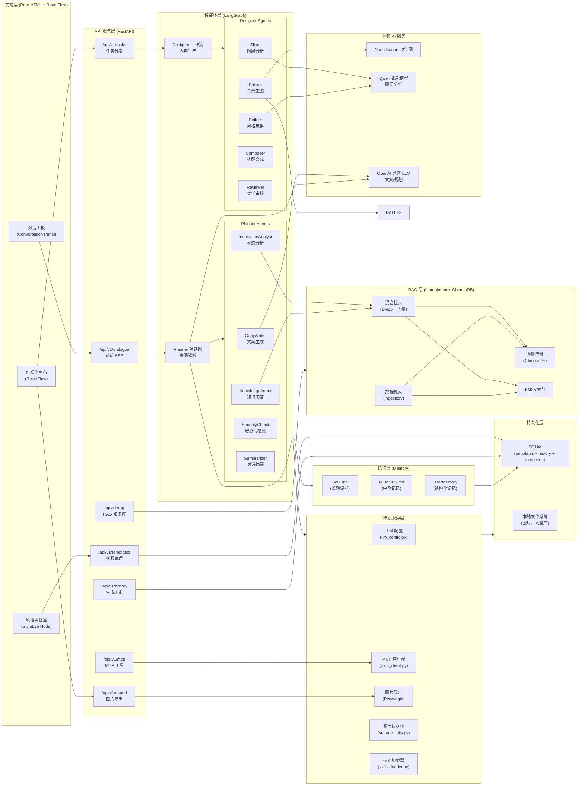
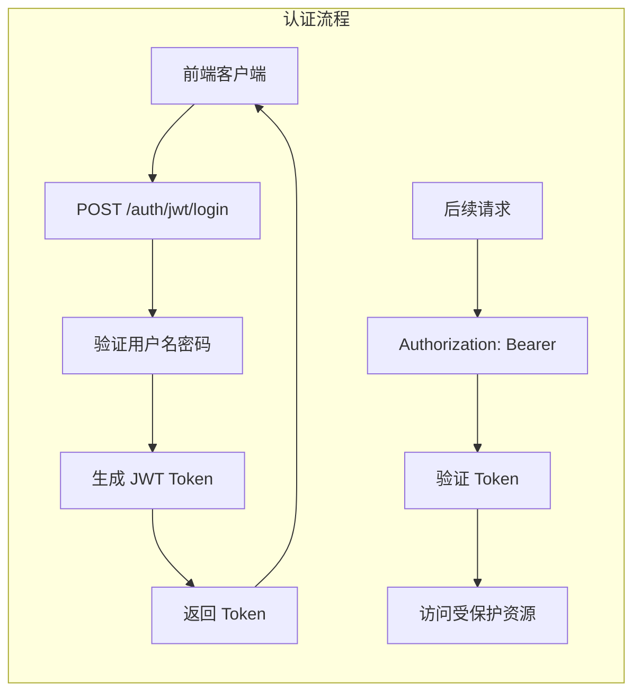
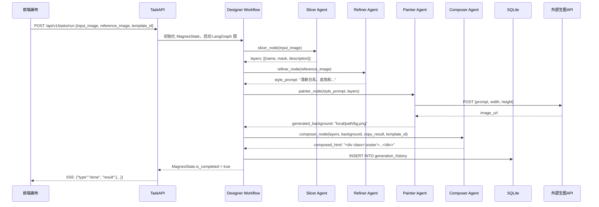
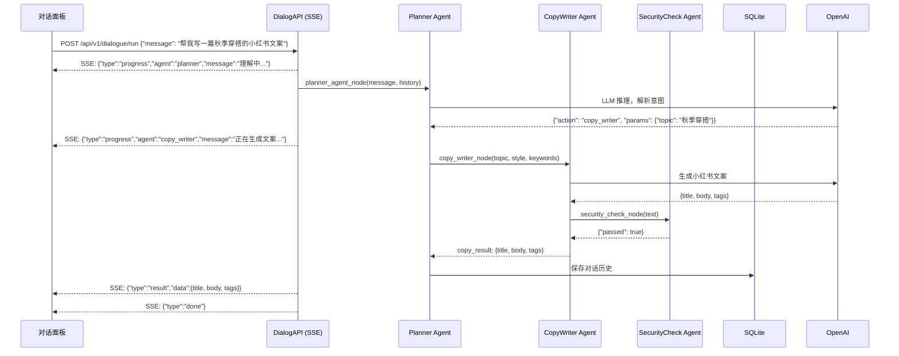
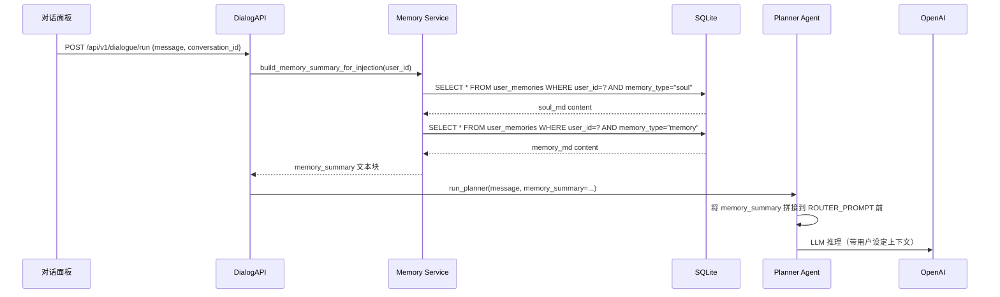
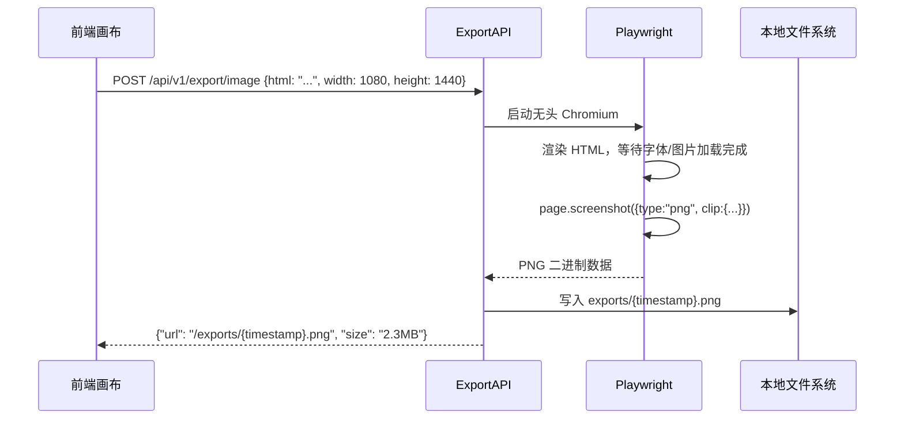
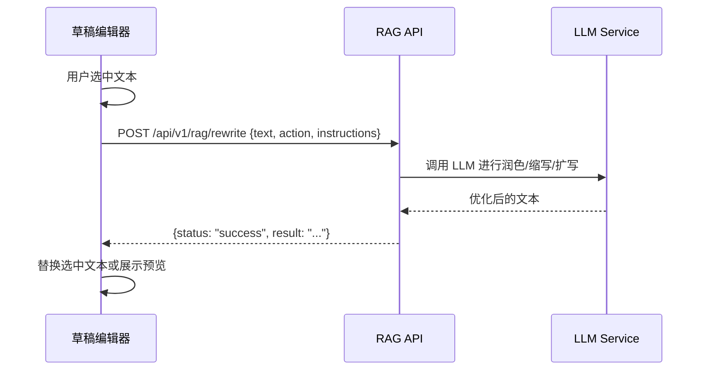

# Magnes Studio - 系统设计文档

## 1. 架构目标

- 提供清晰的分层结构，支持多智能体协同、外部 AI API 集成以及前后端协作。
- 保证在私有化环境中的可扩展性、可观测性和部署可移植性。
- 前端零依赖运行时，降低部署门槛；后端 Agent 可独立扩展，不影响整体稳定性。

## 2. 总体架构




## 3. 认证与安全架构

### 3.1 用户认证系统

基于 FastAPI-Users 实现 JWT Token 认证体系：



**核心组件**：

| 组件 | 文件路径 | 职责 |
|------|----------|------|
| User Model | `backend/app/models/user.py` | 用户数据模型（id, email, username, hashed_password） |
| User Manager | `backend/app/core/users.py` | 用户管理逻辑（创建、验证、Token 生成） |
| Auth Backend | `backend/app/core/users.py` | JWT 策略配置（密钥、过期时间） |
| Auth Router | `backend/app/api/auth.py` | FastAPI-Users 默认路由（注册/登录/刷新） |
| Auth Middleware | `backend/app/middleware/auth.py` | 请求鉴权中间件 |

**Token 结构**：
- Access Token: 15 分钟有效期
- Refresh Token: 7 天有效期
- 算法: HS256
- 载荷包含: user_id, username, aud（受众）

**接口鉴权等级**：

| 路由 | 鉴权要求 |
|------|----------|
| `/api/v1/auth/*` | 公开（注册/登录） |
| `/api/v1/public/*` | 公开（RAG 公共接口） |
| `/api/v1/*` | 需 Bearer Token |

### 3.2 安全中间件

**AuthMiddleware** (`backend/app/middleware/auth.py`)：
- 拦截所有 `/api/v1/*` 请求
- 提取 `Authorization: Bearer <token>` Header
- 验证 JWT Token 有效性
- 将当前用户对象注入请求上下文
- Token 无效时返回 403 Forbidden

---

## 4. 模块视图

### 4.1 展示层（前端）

**技术选型**：纯 HTML + React 18（CDN）+ ReactFlow + Tailwind CSS + Lucide Icons，Babel 仅用于 JSX 编译。

**核心模块**：

| 模块 | 文件 | 职责 |
|------|------|------|
| 主画布 | `frontend/src/app.js` | ReactFlow 初始化、节点注册、全局事件处理、键盘快捷键 |
| 全局状态 | `frontend/src/context/app-context.js` | React Context，管理节点数据、API 配置、对话历史 |
| 对话面板 | `frontend/src/components/ui/conversation-panel.js` | SSE 连接管理、消息渲染、对话历史展示 |
| 节点组件 | `frontend/src/nodes/rf/` | 各类 ReactFlow 节点的 UI 渲染与交互逻辑 |
| 小红书节点 | `frontend/src/nodes/rednote/` | ContentNode、PreviewNode、StyleLabNode 专属逻辑 |
| 生成服务 | `frontend/src/services/generation-service.js` | 任务分发、轮询状态、结果处理 |
| API 客户端 | `frontend/src/utils/api-client.js` | 通用 HTTP 请求封装（含 OpenAI 兼容调用、轮询逻辑） |
| 节点工厂 | `frontend/src/utils/node-helpers.js` | 创建各类节点对象的工厂函数 |

**交互模式**：
- **工作流模式**：在 ReactFlow 画布上拖拽节点、连线，点击执行触发后端工作流。
- **对话模式**：在对话面板输入自然语言，Planner 智能体解析意图并自动创建/调整节点。


**精细编排节点（FineTune Node）**：

| 功能模块 | 文件 | 职责 |
|----------|------|------|
| 主节点组件 | `frontend/src/nodes/rf/fine-tune-node-rf.js` | WYSIWYG 画布渲染、图层管理、历史栈管理 |
| 属性面板 | 集成在主节点内 | 文字样式编辑（字号、字体、颜色、对齐）|

**核心功能设计**：

1. **WYSIWYG 画布**
   - 基于绝对定位渲染图层（使用百分比坐标适配不同尺寸）
   - 支持文字图层和图片图层的混合渲染
   - 背景图自动识别（role 包含 'background'）

2. **图层交互**
   - 拖拽移动：鼠标按下记录初始位置，移动时计算偏移量
   - 缩放调整：8 个方向的手柄（nw, n, ne, e, se, s, sw, w）
   - 吸附对齐：与其他图层边缘/中心线对齐，显示辅助线
   - 双击编辑：文字图层双击进入 contentEditable 模式

3. **撤销/重做系统**
   - 历史栈：`historyStackRef`（最多 50 步）
   - 当前索引：`historyIndexRef`
   - 保存时机：拖拽结束、样式修改、图层增删
   - 撤销标记：`isUndoingRef` 防止撤销操作被记录

4. **字体系统**
   - 字体文件通过 @font-face 定义在 CSS 中
   - 支持字体：系统默认、得意黑、阿里普惠体、江西拙楷、欣意冠黑体
   - 字体切换通过下拉框选择，实时预览

5. **分页与批量导出**
   - 支持多页内容切换（`currentPage`）
   - 每页独立覆写样式（`pageOverrides`）
   - 批量导出使用 html2canvas 串行处理，防止内存溢出

### 4.2 API 服务层（FastAPI）

**核心文件**：`backend/main.py`（FastAPI 应用入口）

**路由模块**：

| 路由前缀 | 文件 | 职责 |
|----------|------|------|
| `/api/v1/tasks` | `api/task_routes.py` | Designer 工作流任务分发与状态查询 |
| `/api/v1/dialogue` | `api/dialogue_routes.py` | Planner 对话 SSE 接口 |
| `/api/v1/rag` | `api/rag_routes.py` | RAG 文档摄入、检索、知识库管理 |
| `/api/v1/templates` | `api/template_routes.py` | 模版 CRUD |
| `/api/v1/history` | `api/history_routes.py` | 生成历史查询 |
| `/api/v1/export` | `api/export_routes.py` | Playwright 截图导出 |
| `/api/v1/mcp` | `api/mcp_routes.py` | MCP 工具调用代理 |
| `/api/v1/prompt` | `api/prompt_routes.py` | Prompt 模版管理 |

**关键中间件**：
- `CORSMiddleware`：跨域处理（当前配置需收紧）
- `lifespan`：应用启动时初始化 LangGraph 工作流、数据库连接

### 4.3 多智能体层

Magnes 采用**层级结构 (Hierarchical Structures)** 与 **专家团队 (Expert Teams)** 相结合的多智能体协作模式。系统通过**意图调度专家 (Planner)** 作为指挥中心，协调三大专业领域智能体，实现从意图识别到高美感画布产出的全链路自动化。

#### 智能体架构概览

| 智能体 | 角色定位 | 直观职责 | 下属功能节点 |
|--------|----------|----------|--------------|
| **意图调度专家 (Planner Agent)** | 意图识别与任务分发中心 | 理解用户在想什么，并指派给谁做 | `planner_agent` (核心决策), `summarizer` (对话压缩) |
| **灵感创意专家 (Creative Agent)** | 内容创作与 RAG 知识检索 | 挖掘趋势、提供创意点并撰写爆款文案 | `inspiration_analyst`, `copy_writer`, `knowledge_agent`, `ingest_urls`, `xhs_search` |
| **画布生成专家 (Designer Agent)** | 视觉分析与画布协议合成 | 负责图层切割、视觉设计、到最后合成为画布成品 | `slicer_node`, `refiner_node`, `painter_node`, `composer_node` |
| **质量合规专家 (Auditor Agent)** | 安全审计与美学质量评价 | 查错、避坑、评分，确保能最终上线 | `security_check`, `reviewer_node` |

#### 核心智能体定义与功能映射

##### 1. 意图调度专家 (Planner Agent)

*   **角色定位**：意图识别与任务分发中心 (Planner/Router)
*   **直观职责**：理解用户在想什么，并指派给谁做
*   **命名逻辑**：负责处理复杂的"意图（Intent）"并进行"任务路由"，是整个系统的指挥官

**下属功能节点**：
- `planner_agent`: 核心决策节点，负责 LLM 意图解析与路径路由
- `summarizer`: 对话上下文压缩与状态持久化管理

**工作流**：
```
START
  └─► planner_agent_node
        ├─► copy_writer → security_check → summarizer → END
        ├─► inspiration_analyst → summarizer → END
        ├─► knowledge_agent → END
        ├─► security_check → END
        ├─► summarizer → END
        └─► END (直接回复)
```

**路由机制**：基于 LLM 输出的 `action` 字段进行条件路由。

**Fast Path 快速路径机制**：`planner_agent.py` 实现了绕过 LLM 的快速响应机制：
- **结构化数据检测**：当检测到用户消息包含 "时间:", "地点:", "门票:" 等结构化字段时，直接触发模版选择流程
- **UI Command Fast Path**：检测 `[技能指令] 确认选择模版:` 格式的消息，直接提取模版 ID 创建节点
- **数字选择 Fast Path**：当用户回复纯数字时，自动映射到对应模版
- **页签上下文感知**：根据 `activeTab`（xhs/canvas）改变行为，如 xhs 页签禁止触发电商技能

**意图识别增强**：
- **视觉激活检测**：检测消息中是否包含图片（`has_vision`）
- **图片历史回溯**：自动从对话历史中提取上下文图片 URL，避免用户重复上传
- **幻觉修正机制**：当 LLM 输出 `chat` action 但内容包含"分析/总结"时，自动修正为 `analyze_inspiration`
- **技能指令注入**：当检测到 `[技能指令]` 或 `[电商生图Skill]` 标记时触发特殊处理

**状态持久化**：使用 `AsyncSqliteSaver` 实现对话状态的持久化存储，支持跨会话恢复。

##### 2. 灵感创意专家 (Creative Agent)

*   **角色定位**：内容创作与 RAG 知识检索 (Content & RAG)
*   **直观职责**：挖掘趋势、提供创意点并撰写爆款文案
*   **命名逻辑**：负责所有的"非视觉"产出（文案和创意点），是设计图的"大脑支持"

**下属功能节点**：
- `inspiration_analyst`: 执行向量数据库 (Chroma) 的语义检索与灵感提炼
- `copy_writer`: 负责生成符合小红书风格的爆款文案
- `knowledge_agent`: 针对垂直知识库进行问答处理
- `ingest_urls`: 外部素材（如链接）的实时抓取与初步解析
- `xhs_search`: 小红书全网灵感实时搜索调度

##### 3. 画布生成专家 (Designer Agent)

*   **角色定位**：视觉分析与画布协议合成 (Design & Canvas)
*   **直观职责**：负责图层切割、视觉设计、到最后合成为画布成品
*   **命名逻辑**：不管中间怎么切、怎么画、怎么微调坐标，最终目标是交付一张完整的"画布（Canvas）"

**下属功能节点**：
- `slicer_node`: 执行物理图层的图像切割（U-Net/SAM 逻辑）
- `refiner_node`: 负责画布逻辑布局建模，确定组件坐标与层级
- `painter_node`: 驱动 AI 扩图与背景重绘（Diffusion 逻辑）
- `composer_node`: 整合全链路资产，输出标准的 Magnes JSON 协议

**工作流**（`backend/app/core/workflow.py`）：
```
START
  └─► init_node
        ├─► slicer_node (若有输入图片)
        │     └─► painter_node (若需生图)
        ├─► refiner_node (若有参考图)
        │     └─► painter_node
        └─► knowledge_agent (若需知识问答)
              └─► END
  painter_node / slicer_node / refiner_node
        └─► composer_node
              └─► reviewer_node
                    └─► END
```

**状态对象**：`MagnesState`（TypedDict，`backend/app/schema/state.py`）
- `input_image`：输入图片路径/URL
- `reference_image`：参考风格图路径/URL
- `style_prompt`：Refiner 输出的风格描述
- `generated_background`：Painter 输出的背景图
- `layers`：Slicer 输出的图层列表
- `composed_html`：Composer 输出的排版 HTML
- `copy_result`：CopyWriter 输出的文案
- `current_step`：当前执行节点名称
- `is_completed`：是否完成
- `error`：错误信息

##### 4. 质量合规专家 (Auditor Agent)

*   **角色定位**：安全审计与美学质量评价 (Security & Quality)
*   **直观职责**：查错、避坑、评分，确保能最终上线
*   **命名逻辑**：扮演"考官"角色，集安全合规审查与美学评分于一身

**下属功能节点**：
- `security_check`: 敏感词过滤与输出安全性校验
- `reviewer_node`: 对最终生成的画布进行美学评分与完整性自检

#### 协作模式详解

| 协作模式 | 说明 | 在项目中的体现 |
|----------|------|----------------|
| **层级结构** | 调度专家接收用户输入，通过条件边动态决定激活哪些后续专家节点 | `意图调度专家` → `(创意专家 + 生成专家)` → `合规专家` |
| **专家团队** | 各智能体各司其职，每个节点拥有独立的 Prompt 模板和工具集 | 创意专家专注文字灵魂，生成专家专注视觉构建 |
| **并行处理** | 物理切片与逻辑建模允许异步/并行执行 | `slicer_node` 与 `refiner_node` 可并行执行 |
| **批评-审查者** | 在工作流末端闭环，对产出进行美学质量与安全政策的双重审计 | `security_check` → `reviewer_node` |

#### Skill 系统架构

Skill 是 Magnes 中可插拔的业务能力模块，位于 `backend/.agent/skills/` 目录：

```
.agent/skills/
└── ecommerce-image-gen/          # 电商生图 Skill
    ├── SKILL.md                  # Skill 定义文档
    ├── references/
    │   └── categories.md         # 分类配置
    └── assets/
        └── reference-images/     # 风格参考图库
            ├── cosmetics/        # 美妆分类
            ├── food/             # 食品分类
            └── electronics/      # 电子分类
```

**Skill 加载机制**：`skills_loader.py` 动态扫描 Skill 目录，将 SKILL.md 转化为 Prompt 指令。

**Skill 探测逻辑**（`planner/skills.py`）：
- 通过关键词匹配（如 "1"、"电商生图"）自动识别用户意图
- 动态构建增强 Prompt，注入分类配置和风格参考图库
- 强制使用角色化 Prompt 模板（Image 1 + Image 2 格式）

#### 小红书 MCP 工具层（`backend/app/tools/xhs_mcp_tools.py`）

| 工具方法 | 功能 | 降级机制 |
|----------|------|----------|
| `search_feeds(keyword)` | 搜索小红书笔记 | SSE 失败时降级到 REST API (localhost:18060) |
| `get_feed_detail(feed_id, xsec_token)` | 获取笔记详情 | 自动提取 note_card、interact_info、image_list |
| `get_note_detail(short_url)` | 通过 URL 获取详情 | MCP Fallback 方案 |
| `publish_note(title, content, image_urls)` | 发布图文笔记 | 需用户二次确认 |
| `get_self_info()` | 获取当前用户信息 | - |

**xsec_token 管理**：自动从搜索结果提取并传递反爬 token，支持详情页采集。

### 4.4 记忆层（`backend/app/memory/`）

| 模块 | 文件 | 职责 |
|------|------|------|
| 数据模型 | `memory/models.py` | `UserMemory`、`ConversationSummary`、`CanvasActionLog` 三个 SQLAlchemy 模型 |
| Schema | `memory/schemas.py` | Pydantic 请求/响应模型（`MemoryCreateRequest`、`SoulMdRequest`、`MemoryMdRequest` 等） |
| 核心服务 | `memory/service.py` | CRUD、upsert、以及 `build_memory_summary_for_injection()` 组装 prompt-ready 摘要 |
| 路由 | `memory/routes.py` | FastAPI 路由，挂载于 `/api/v1/memory/*` |

**存储策略**：
- Soul.md 和 MEMORY.md 均存储于 `user_memories` 表，不新增独立表。
- `memory_type="soul"`、`key="soul_md"`、`confidence=1.0`
- `memory_type="memory"`、`key="memory_md"`、`confidence=1.0`
- 每个用户每种文档最多一条，按 `user_id + memory_type + key` 联合唯一约束做 upsert。

**注入流程**：
1. `dialogue_routes.py` 在调用 `run_planner()` 前，请求 `memory_service.build_memory_summary_for_injection(user_id)`。
2. 服务层按以下顺序组装文本：
   - Soul.md（若存在）
   - MEMORY.md（若存在）
   - preference 列表（后端已支持，当前无前端入口）
   - rejection 列表（后端已支持，当前无前端入口）
3. `run_planner()` 将摘要写入 `PlannerState.memory_summary`。
4. `router.py` 的 `call_model()` 在 `ROUTER_PROMPT` 前追加 `[用户设定]\n{memory_summary}\n\n---\n\n`。

### 4.5 RAG 层（`backend/app/rag/`）

| 模块 | 文件 | 职责 |
|------|------|------|
| 数据摄入 | `rag/ingestion/` | URL/文件/文本摄入，切块，向量化，存入 ChromaDB |
| 向量存储 | `rag/vectorstore/` | ChromaDB 集合管理，向量 CRUD |
| 混合检索 | `rag/retrieval/` | BM25 + 向量检索并行，RRF 融合排序 |
| 风格记忆 | `rag/style_memory_agent.py` | 记录用户风格偏好，生成个性化检索上下文 |
| 配置 | `rag/config.py` | 模型、分块策略（chunk_size=512, overlap=50）、ChromaDB 路径 |

**检索流程**：
1. 查询向量化（Embedding）
2. ChromaDB 向量检索（top-k=5）
3. BM25 关键词检索（top-k=5）
4. RRF（Reciprocal Rank Fusion）融合，返回最终 top-5 结果
5. 注入 LLM 上下文（RAG Prompt）

### 4.6 核心服务层（`backend/app/core/`）

| 文件 | 职责 |
|------|------|
| `llm_config.py` | LLM 实例工厂，支持 OpenAI 兼容接口，通过环境变量切换 Provider |
| `database.py` | SQLAlchemy + aiosqlite 异步引擎与 Session 工厂 |
| `image_generator.py` | Playwright 无头浏览器，HTML → 高分辨率 PNG |
| `mcp_client.py` | MCP 协议客户端，连接外部 MCP Server |
| `storage_utils.py` | 图片 URL 下载并持久化到本地，返回本地路径 |
| `skills_loader.py` | 扫描 `skills/` 目录，动态加载业务技能包 |
| `prompts.py` | 中央 Prompt 库，所有 Agent 的 System Prompt 统一管理 |

## 5. 序列图

### 5.1 Designer 工作流执行序列（生成小红书海报）



### 5.2 Planner 对话序列（文案生成）



### 5.3 记忆注入序列



### 5.4 图片导出序列



### 5.5 文案润色序列



## 6. 错误与回退策略

| 场景 | 处理方式 |
|------|----------|
| LangGraph 图执行超时（>10min） | `asyncio.wait_for` 捕获，返回已完成节点的部分结果 |
| Painter 生图 API 失败（3次重试后） | Composer 跳过背景图层，使用纯色/渐变兜底 |
| Slicer/Refiner 视觉模型失败 | 跳过该节点，style_prompt 使用默认值，layers 为空 |
| RAG 检索失败 | 不注入检索上下文，LLM 使用自身知识生成 |
| Playwright 截图失败 | 返回 500 错误，前端提示用户重试 |
| SQLite 写入失败 | 记录错误日志，不影响当前生成任务的结果返回 |
| SSE 连接中断 | 前端自动重连（最多3次），重连后查询任务最新状态 |
| MCP 工具调用失败 | 捕获异常，跳过该工具调用，继续执行其他节点 |
| 文案润色失败 | 保留原文案，提示用户重试或手动编辑 |
| 小红书 MCP SSE 连接失败 | 自动降级到 REST API (localhost:18060) |
| xsec_token 过期/失效 | 提示用户重新搜索获取有效 token |
| Memory 注入失败 | 记录日志，不影响对话执行，`memory_summary` 为空字符串继续 |
| Soul.md / MEMORY.md 保存失败 | 前端 alert 提示用户重试，不自动重试避免覆盖 |

## 7. 扩展点

- **新增 Agent**：在 `backend/app/agents/` 下新建文件，在 `workflow.py` 或 `planner/graph.py` 中注册节点即可。
- **新增节点类型**：在 `frontend/src/nodes/rf/` 下新建组件，在 `app.js` 的 `nodeTypes` 映射表中注册。
- **新增生图引擎**：在 `tools/painting_tool.py` 中添加新的 Provider 分支，通过环境变量切换。
- **数据库迁移**：SQLite → PostgreSQL，只需修改 `core/database.py` 中的连接字符串。
- **RAG 扩展**：在 `rag/ingestion/` 中添加新的数据源适配器（如爬虫、数据库导入）。
- **技能包扩展**：在 `backend/app/skills/` 目录下新增技能包，`skills_loader.py` 自动发现加载。
- **OpenClaw Skill 封装**：在 `openclaw_skill/` 目录下开发独立 Skill，通过 API 对接 Magnes 后端，无需修改原项目代码。
- **记忆系统扩展**：新增 `memory_type` 即可支持新的记忆类别；前端在 `AppModals.js` 中新增 Tab 和表单即可暴露新的记忆编辑入口。
- **自动学习扩展**：在 `memory/service.py` 中增加对话摘要自动提取逻辑，将 LLM 总结结果写入 `preference` / `rejection` / `workflow` 类型记忆。

## 8. 安全与合规

- 所有 API Key 和 SessionID 通过 `.env` 管理，禁止在前端 JS 或代码仓库中硬编码。
- 生产环境使用 HTTPS，建议配合 Nginx 反向代理和 API Gateway。
- CORS 策略收紧到具体域名，禁止 `null` origin。
- 所有 API 路由添加 Bearer Token 认证，防止未授权访问消耗 AI API 配额。
- 生成历史存储于本地 SQLite，不上传外部服务；支持配置数据保留策略（如 90 天自动清理）。
- 敏感词检测在文案发布前强制执行，过滤违禁内容。

## 9. 日志与监控建议

- **日志**：使用 Python `logging` 模块输出结构化日志，包含 `task_id`、Agent 名称、耗时、错误信息。
- **关键指标**：
  - 任务完成率（completed / total）
  - 各 Agent 平均执行时长
  - 外部 AI API 调用成功率与耗时
  - RAG 检索命中率
  - Playwright 导出成功率
- **监控建议**：接入 Prometheus + Grafana，或使用云端 APM（如阿里云 ARMS）。
- **告警场景**：Painter 连续 5 次失败、LLM 调用 P99 > 30s、SQLite 写入错误率 > 1%。
