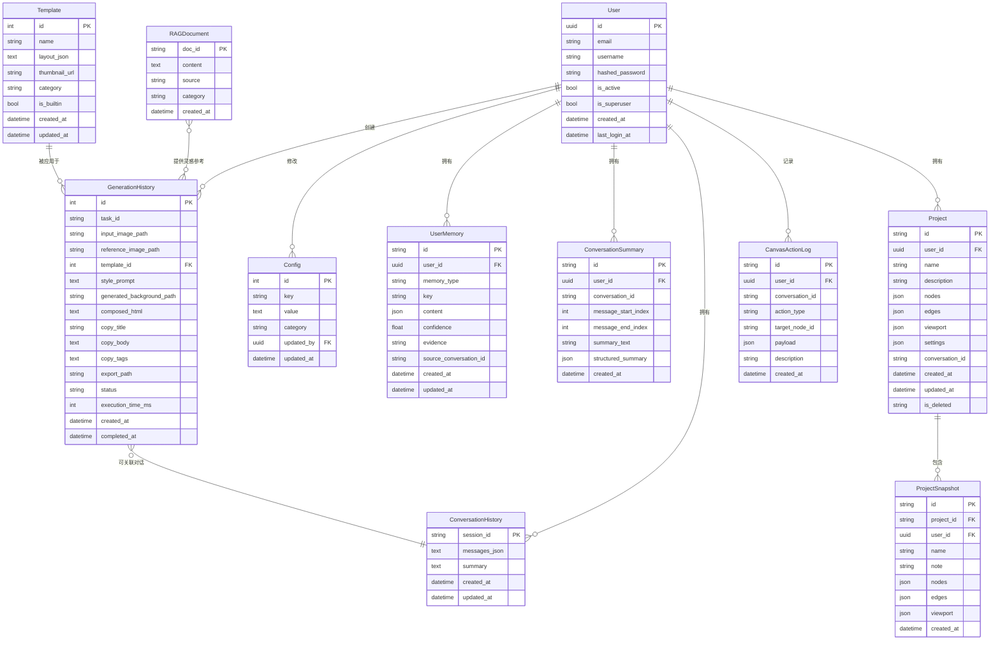
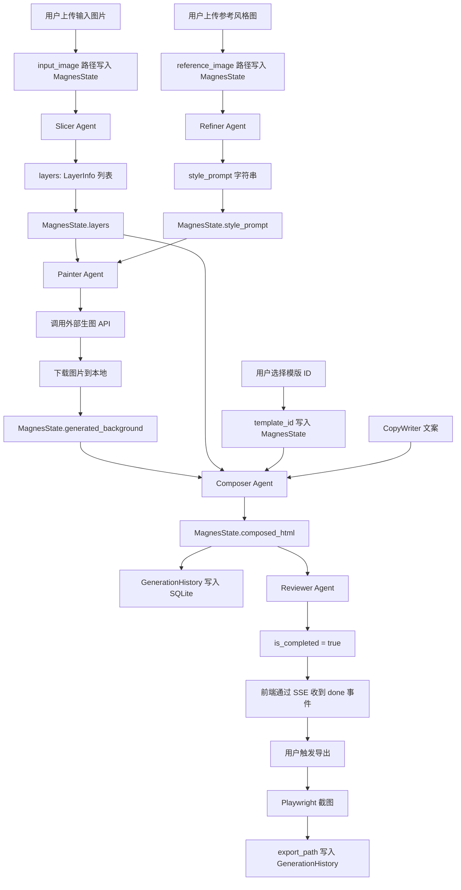
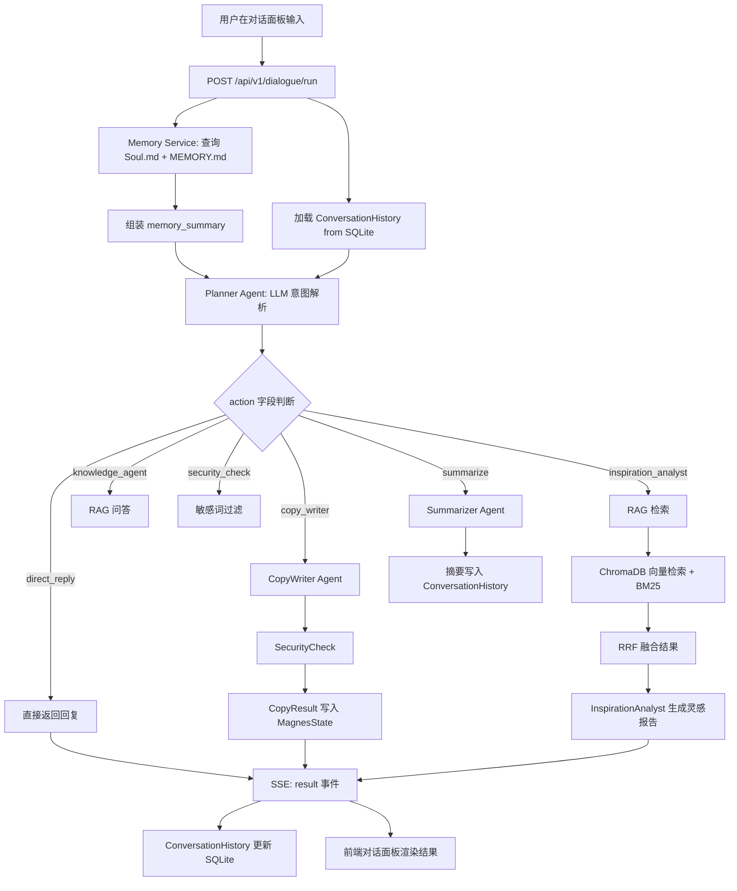

# Magnes Studio - 数据设计文档

## 1. 数据设计目标

描述 Magnes Studio 内容生产过程中涉及的核心数据实体、关系、数据流与存储策略，指导后续数据库扩展、数据迁移和接口设计。

## 2. 数据实体与属性

### 2.1 Template（排版模版）

SQLAlchemy ORM 模型，存储于 SQLite `templates` 表。

| 字段 | 类型 | 说明 |
|------|------|------|
| `id` | Integer (PK, Auto) | 主键 |
| `name` | String(100) | 模版名称（如"门票风"、"杂志风"） |
| `description` | Text | 模版描述 |
| `layout_json` | JSON/Text | 排版定义（布局、字体、色彩、元素位置） |
| `thumbnail_url` | String(500) | 模版缩略图 URL |
| `category` | String(50) | 分类（如 rednote、poster、story） |
| `is_builtin` | Boolean | 是否为系统内置模版 |
| `created_at` | DateTime | 创建时间 |
| `updated_at` | DateTime | 最后更新时间 |

**`layout_json` 数据结构示例**：
```json
{
  "width": 1080,
  "height": 1440,
  "background": {"type": "image", "layer": "generated_background"},
  "elements": [
    {"type": "text", "id": "title", "x": 60, "y": 80, "width": 960, "fontSize": 48, "fontFamily": "PingFang SC", "color": "#FFFFFF", "fontWeight": "bold", "align": "center"},
    {"type": "text", "id": "body", "x": 60, "y": 200, "width": 960, "fontSize": 28, "color": "#F0F0F0", "lineHeight": 1.6},
    {"type": "image", "id": "product", "x": 100, "y": 400, "width": 880, "height": 700, "layer": "product_layer"},
    {"type": "tags", "id": "hashtags", "x": 60, "y": 1350, "fontSize": 24, "color": "#FFD700"}
  ]
}
```

---

### 2.2 GenerationHistory（生成历史）

SQLAlchemy ORM 模型，存储于 SQLite `generation_history` 表。

| 字段 | 类型 | 说明 |
|------|------|------|
| `id` | Integer (PK, Auto) | 主键 |
| `task_id` | String(36) | 任务唯一 ID（UUID） |
| `input_image_path` | String(500) | 输入图片本地路径（可为空） |
| `reference_image_path` | String(500) | 参考风格图本地路径（可为空） |
| `template_id` | Integer (FK) | 使用的模版 ID |
| `style_prompt` | Text | Refiner 提取的风格描述 |
| `generated_background_path` | String(500) | 生成背景图本地路径 |
| `composed_html` | Text | Composer 输出的排版 HTML |
| `copy_title` | String(200) | 生成的文案标题 |
| `copy_body` | Text | 生成的文案正文 |
| `copy_tags` | Text | 生成的话题标签（逗号分隔） |
| `export_path` | String(500) | 导出图片本地路径（可为空） |
| `status` | String(20) | 任务状态（pending/running/completed/failed） |
| `error_message` | Text | 失败原因（可为空） |
| `execution_time_ms` | Integer | 总执行时长（毫秒） |
| `llm_provider` | String(50) | 使用的 LLM Provider 名称 |
| `image_provider` | String(50) | 使用的生图 Provider 名称 |
| `created_at` | DateTime | 创建时间 |
| `completed_at` | DateTime | 完成时间（可为空） |

---

### 2.3 MagnesState（LangGraph 工作流状态）

`TypedDict`，贯穿 Designer 工作流全生命周期，存储于内存，最终写入 `GenerationHistory`。

| 字段 | 类型 | 说明 |
|------|------|------|
| `task_id` | str | 任务 ID |
| `input_image` | Optional[str] | 输入图片路径/URL |
| `reference_image` | Optional[str] | 参考风格图路径/URL |
| `template_id` | Optional[int] | 选择的模版 ID |
| `user_prompt` | Optional[str] | 用户输入的需求描述 |
| `style_prompt` | Optional[str] | Refiner 输出的风格描述 Prompt |
| `layers` | Optional[List[LayerInfo]] | Slicer 输出的图层列表 |
| `generated_background` | Optional[str] | Painter 输出的背景图本地路径 |
| `copy_result` | Optional[CopyResult] | CopyWriter 输出的文案 |
| `composed_html` | Optional[str] | Composer 输出的排版 HTML |
| `review_score` | Optional[float] | Reviewer 输出的美学评分 |
| `current_step` | str | 当前执行的节点名称 |
| `is_completed` | bool | 是否已完成 |
| `error` | Optional[str] | 错误信息 |
| `messages` | List[BaseMessage] | Planner 对话历史（LangChain 消息列表） |

---

### 2.4 User（用户）

基于 FastAPI-Users 的用户模型，存储于 SQLite `user` 表。

| 字段 | 类型 | 说明 |
|------|------|------|
| `id` | UUID (PK) | 用户唯一 ID（UUID4） |
| `email` | String(320) | 邮箱地址（唯一） |
| `username` | String(50) | 用户名（唯一） |
| `hashed_password` | String(1024) | bcrypt 加密后的密码 |
| `is_active` | Boolean | 账户是否激活（默认 True） |
| `is_superuser` | Boolean | 是否为超级用户（默认 False） |
| `is_verified` | Boolean | 邮箱是否验证（默认 False） |
| `created_at` | DateTime | 注册时间 |
| `updated_at` | DateTime | 最后更新时间 |
| `last_login_at` | DateTime | 最后登录时间（可为空） |

**关联关系**：
- 一个用户可创建多个 `GenerationHistory` 记录
- 一个用户可拥有多个 `ConversationHistory` 会话

---

### 2.5 LayerInfo（图层信息）

Slicer Agent 输出，临时存储于 `MagnesState.layers`。

| 字段 | 类型 | 说明 |
|------|------|------|
| `name` | str | 图层名称（如"主体"、"背景"、"文字"） |
| `layer_type` | str | 图层类型（subject/background/text/decoration） |
| `description` | str | 图层内容描述 |
| `mask_base64` | Optional[str] | 遮罩图（Base64 编码 PNG，可为空） |
| `bbox` | Optional[List[int]] | 边界框 [x, y, width, height] |
| `confidence` | float | 识别置信度（0.0~1.0） |

---

### 2.6 CopyResult（文案结果）

CopyWriter Agent 输出，临时存储于 `MagnesState.copy_result`。

| 字段 | 类型 | 说明 |
|------|------|------|
| `title` | str | 小红书标题（含 Emoji，≤25 字） |
| `body` | str | 正文（分段，含 Emoji，300~500 字） |
| `tags` | List[str] | 话题标签列表（5~10 个，如 ["#秋季穿搭", "#OOTD"]） |
| `call_to_action` | Optional[str] | 引导语（如"点赞收藏不迷路～"） |
| `security_passed` | bool | 是否通过敏感词检测 |
| `flagged_words` | List[str] | 触发的敏感词列表（空则通过） |

---

### 2.7 RAGDocument（RAG 知识库文档）

存储于 ChromaDB 向量集合，同时建立 BM25 索引。

| 字段 | 类型 | 说明 |
|------|------|------|
| `doc_id` | str | 文档唯一 ID |
| `content` | str | 文档内容（分块后的文本片段） |
| `embedding` | List[float] | 向量表示（维度由 Embedding 模型决定） |
| `metadata.source` | str | 来源（URL、文件名、手动输入） |
| `metadata.category` | str | 分类（style_reference、inspiration、brand_guide） |
| `metadata.created_at` | str | 摄入时间（ISO 格式） |
| `metadata.chunk_index` | int | 所属文档的分块序号 |

---

### 2.8 ConversationHistory（对话历史）

存储于 SQLite（通过 LangGraph 持久化），格式为 LangChain 消息列表的 JSON 序列化。

| 字段 | 类型 | 说明 |
|------|------|------|
| `session_id` | str | 会话唯一 ID |
| `messages_json` | Text | LangChain 消息列表 JSON |
| `summary` | Optional[Text] | 长对话摘要（Summarizer 输出） |
| `created_at` | DateTime | 创建时间 |
| `updated_at` | DateTime | 最后更新时间 |

---

### 2.9 Config（系统配置）

存储系统运行时配置，存储于 SQLite `config` 表。

| 字段 | 类型 | 说明 |
|------|------|------|
| `id` | Integer (PK, Auto) | 主键 |
| `key` | String(100) | 配置项键名（唯一） |
| `value` | Text | 配置项值（JSON 格式） |
| `category` | String(50) | 分类（llm/storage/features） |
| `description` | String(500) | 配置说明 |
| `updated_by` | UUID (FK) | 最后修改者（关联 User） |
| `updated_at` | DateTime | 最后更新时间 |

**常用配置项**：
| key | value 示例 | 说明 |
|-----|------------|------|
| `max_concurrent_tasks` | `5` | 最大并发生成任务数 |
| `rag_enabled` | `true` | 是否启用 RAG 功能 |
| `mcp_enabled` | `true` | 是否启用 MCP 工具 |
| `default_llm_model` | `"gpt-4o"` | 默认 LLM 模型 |

---

### 2.10 FineTuneState（精细编排状态）

精细编排节点的运行时状态，存储于前端内存，最终可保存到 `GenerationHistory.finetune_state`。

| 字段 | 类型 | 说明 |
|------|------|------|
| `layers` | List[Layer] | 图层列表 |
| `current_page` | int | 当前页码（从 0 开始） |
| `total_pages` | int | 总页数 |
| `page_overrides` | Dict[int, PageOverride] | 每页的覆写样式 |
| `history_stack` | List[HistoryState] | 撤销/重做历史栈 |
| `history_index` | int | 当前历史索引 |
| `is_dirty` | bool | 是否有未保存的修改 |

**Layer 结构**：
| 字段 | 类型 | 说明 |
|------|------|------|
| `id` | str | 图层唯一 ID |
| `type` | str | 类型（text/image/background） |
| `content` | str | 文字内容或图片 URL |
| `bbox` | List[int] | 边界框 [x, y, width, height] |
| `style` | Dict | 样式（fontSize, color, fontFamily, etc.） |
| `z_index` | int | 层级顺序 |
| `is_variable` | bool | 是否为变量（可被替换） |

---

### 2.11 Project（画布项目）

SQLAlchemy ORM 模型，存储于 SQLite `projects` 表。保存完整的 ReactFlow 画布状态，支持跨会话恢复。

| 字段 | 类型 | 说明 |
|------|------|------|
| `id` | String (PK) | UUID4 主键 |
| `user_id` | String (FK) | 关联 `users.id`，带索引 |
| `name` | String | 项目名称（默认"未命名项目"） |
| `description` | String | 项目描述，可选 |
| `nodes` | JSON | ReactFlow 节点数组（完整状态） |
| `edges` | JSON | ReactFlow 边数组 |
| `viewport` | JSON | 视口状态 `{x, y, zoom}` |
| `settings` | JSON | 项目级配置（如 itemsPerPage, theme） |
| `conversation_id` | String | 当前激活的会话 ID，可选 |
| `created_at` | DateTime | 创建时间 |
| `updated_at` | DateTime | 最后更新时间 |
| `is_deleted` | String | 软删除标记（"0"=正常, "1"=已删除） |

**索引**：
- `ix_projects_user_updated` — 复合索引 (`user_id`, `updated_at`)，加速按用户查询最近项目

**缩略图提取**：
- `_extract_thumbnail_from_nodes()` 方法自动从 `nodes` 数据中递归搜索第一张图片 URL
- 覆盖字段：`url`, `imageUrl`, `image_url`, `src`, `background`, `resultImage`, `outputUrl` 等
- 列表接口 `to_summary_dict()` 返回 `thumbnailUrl`，用于"我的项目"卡片展示

---

### 2.12 ProjectSnapshot（项目快照）

SQLAlchemy ORM 模型，存储于 SQLite `project_snapshots` 表。用于项目版本控制和里程碑回溯。

| 字段 | 类型 | 说明 |
|------|------|------|
| `id` | String (PK) | UUID4 主键 |
| `project_id` | String (FK) | 关联 `projects.id` |
| `user_id` | String (FK) | 关联 `users.id` |
| `name` | String | 快照名称（如"v1.0 初稿"） |
| `note` | String | 快照备注 |
| `nodes` | JSON | 节点状态（创建时的副本） |
| `edges` | JSON | 边状态 |
| `viewport` | JSON | 视口状态 |
| `created_at` | DateTime | 创建时间 |

---

### 2.13 UserMemory（用户记忆）

SQLAlchemy ORM 模型，存储于 SQLite `user_memories` 表。统一承载 Soul.md、MEMORY.md 及各类结构化记忆。

| 字段 | 类型 | 说明 |
|------|------|------|
| `id` | String (PK) | UUID4 主键 |
| `user_id` | String (FK) | 关联 `users.id`，带索引 |
| `memory_type` | String | `soul` \| `memory` \| `preference` \| `rejection` \| `template` \| `style` \| `workflow` \| `custom` |
| `key` | String | 人类可读的键名 |
| `content` | JSON | 结构化内容（Soul/Memory 存储 `{"text": "..."}`） |
| `confidence` | Float | 可信度 0.0~1.0，默认 0.5（Soul/Memory 固定 1.0） |
| `evidence` | String | 证据摘要，可选 |
| `source_conversation_id` | String | 来源会话 ID，可选 |
| `created_at` | DateTime | 创建时间 |
| `updated_at` | DateTime | 最后更新时间 |

**索引**：
- `ix_user_memories_user_type` — 复合索引 (`user_id`, `memory_type`)，加速按用户+类型查询。

**关联关系**：
- `owner = relationship("User", back_populates="memories")`

---

### 2.14 ConversationSummary（对话摘要）

SQLAlchemy ORM 模型，存储于 SQLite `conversation_summaries` 表。用于长对话压缩与上下文管理。

| 字段 | 类型 | 说明 |
|------|------|------|
| `id` | String (PK) | UUID4 主键 |
| `user_id` | String (FK) | 关联 `users.id` |
| `conversation_id` | String | 会话 ID，带索引 |
| `message_start_index` | Integer | 被摘要覆盖的消息起始索引 |
| `message_end_index` | Integer | 被摘要覆盖的消息结束索引 |
| `summary_text` | String | LLM 生成的摘要文本 |
| `structured_summary` | JSON | 结构化摘要（任务状态、决策、TODO 等） |
| `created_at` | DateTime | 创建时间 |

**索引**：
- `ix_conv_summaries_conv` — 复合索引 (`conversation_id`, `message_end_index`)

---

### 2.15 CanvasActionLog（画布操作日志）

SQLAlchemy ORM 模型，存储于 SQLite `canvas_action_logs` 表。记录用户在画布上的关键操作，用于后续行为分析与操作回溯。

| 字段 | 类型 | 说明 |
|------|------|------|
| `id` | String (PK) | UUID4 主键 |
| `user_id` | String (FK) | 关联 `users.id` |
| `conversation_id` | String | 会话 ID，可选 |
| `action_type` | String | `node_create` \| `node_delete` \| `node_update` \| `edge_connect` \| `asset_replace` \| `text_edit` \| `publish` |
| `target_node_id` | String | 目标节点 ID，可选 |
| `payload` | JSON | 动作详情 JSON |
| `description` | String | 用于语义检索的文本快照 |
| `created_at` | DateTime | 创建时间 |

---

## 3. 实体关系模型



---

## 4. 数据流设计

### 4.1 Designer 工作流数据流



### 4.2 Planner 对话数据流



### 4.3 Project 持久化与记忆回流数据流

```mermaid
flowchart TD
    subgraph 前端画布
        A[用户操作画布] --> B[nodes/edges/viewport 变化]
        B --> C[2秒防抖自动保存]
        C --> D[PUT /api/v1/projects/{id}]
        B --> E[记录 CanvasActionLog]
        E --> F[POST /api/v1/projects/action-log]
    end

    subgraph 后端存储
        D --> G[projects 表更新]
        F --> H[canvas_action_logs 表写入]
        G --> I[返回更新后的项目摘要]
    end

    subgraph 记忆回流分析
        J[定时触发 / 用户主动触发] --> K[GET 最近N条 CanvasActionLog]
        K --> L[LLM 分析用户行为模式]
        L --> M{提取偏好?}
        M -->|是| N[写入 user_memories 表]
        M -->|否| O[跳过]
        N --> P[注入 Planner Agent system prompt]
    end

    subgraph 项目恢复
        Q[前端 mount] --> R[GET /api/v1/projects/last-active]
        R --> S[加载 nodes/edges/viewport]
        S --> T[恢复 ReactFlow 画布状态]
    end

    I --> U[我的项目卡片展示]
    U --> V[显示缩略图 + 更新时间]
```

---

## 5. 数据存储策略

| 数据类型 | 存储介质 | 策略 |
|----------|----------|------|
| 模版数据（Template） | SQLite `templates` 表 | 持久化，支持 CRUD |
| 生成历史（GenerationHistory） | SQLite `generation_history` 表 | 持久化，建议保留 90 天 |
| 对话历史（ConversationHistory） | SQLite（LangGraph 持久化） | 持久化，摘要后可压缩 |
| 用户记忆（UserMemory） | SQLite `user_memories` 表 | 持久化，Soul/Memory 按用户 upsert，结构化记忆支持 CRUD |
| 对话摘要（ConversationSummary） | SQLite `conversation_summaries` 表 | 持久化，长对话压缩后保留 |
| 画布项目（Project） | SQLite `projects` 表 | 持久化，软删除，建议保留 90 天 |
| 项目快照（ProjectSnapshot） | SQLite `project_snapshots` 表 | 持久化，每个项目保留最近 20 个快照 |
| 画布操作日志（CanvasActionLog） | SQLite `canvas_action_logs` 表 | 持久化，建议保留 30 天 |
| 工作流运行时状态（MagnesState） | Python 内存 | 临时，任务完成后写入 GenerationHistory |
| 生成图片、导出文件 | 本地文件系统（`backend/storage/`） | 持久化，定期清理过期文件 |
| RAG 向量数据（RAGDocument） | ChromaDB 本地集合 | 持久化，需定期备份 |
| RAG BM25 索引 | 内存 + 序列化文件 | 持久化到 `rag/bm25_index.pkl` |

**数据保留策略建议**：
- `projects`：保留最近 90 天（可配置），软删除的条目可延迟清理。
- `project_snapshots`：每个项目保留最近 20 个快照，超限自动删除最旧的。
- `generation_history`：保留最近 90 天（可配置）。
- `user_memories`：永久保留，Soul.md 和 MEMORY.md 为用户核心资产，删除需二次确认。
- `canvas_action_logs`：保留最近 30 天，用于行为分析。
- 生成图片文件：保留最近 30 天，或手动删除。
- ChromaDB 向量集合：永久保留，支持手动清理特定集合。
- 对话历史：摘要后保留 60 天。

---

## 6. 数据质量与校验

### 6.1 输入校验

| 字段 | 校验规则 |
|------|----------|
| `input_image` / `reference_image` | 文件格式须为 PNG/JPG/WEBP，大小 ≤ 20MB |
| `template_id` | 必须存在于 `templates` 表，否则返回 404 |
| `user_prompt` | 非空字符串，长度 ≤ 2000 字符 |
| 文案内容 | 通过 SecurityCheck 过滤敏感词 |

### 6.2 外部数据处理

- 外部图片 URL 下载前检查 `Content-Type` 是否为图片类型。
- 下载文件大小限制 ≤ 50MB（待实现，当前无此限制）。
- Qwen 视觉模型返回的 JSON 通过 `parser.py` 鲁棒解析，容忍非标准 JSON。
- LLM 输出的文案通过 Pydantic 模型解析校验，字段缺失时使用默认值。

### 6.3 生成结果

- `GenerationHistory` 记录写入时自动填充 `created_at`（UTC）。
- `execution_time_ms` 在任务完成时计算（`completed_at - created_at`）。
- 失败任务的 `error_message` 截断至 2000 字符，避免 SQLite 存储过大。

---

## 7. 扩展性建议

- **数据库迁移**：引入 PostgreSQL，使用 Alembic 管理迁移脚本，支持并发写入与连接池。
- **对象存储**：将本地文件系统替换为阿里云 OSS / 腾讯云 COS，支持 CDN 加速图片访问。
- **RAG 数据增强**：增加用户偏好画像（基于历史生成记录），个性化检索排序。
- **数据分析**：接入 BI 工具，分析高频风格、热门模版、生成成功率等运营指标。
- **版本管理**：对 `GenerationHistory` 增加 `version` 字段，支持同一任务的多次迭代历史追踪。
- **多租户**：增加 `workspace_id` 字段，支持多团队隔离数据。
