# Magnes Studio - 关键业务流程文档

## 2. 用户认证流程

### 2.1 登录流程

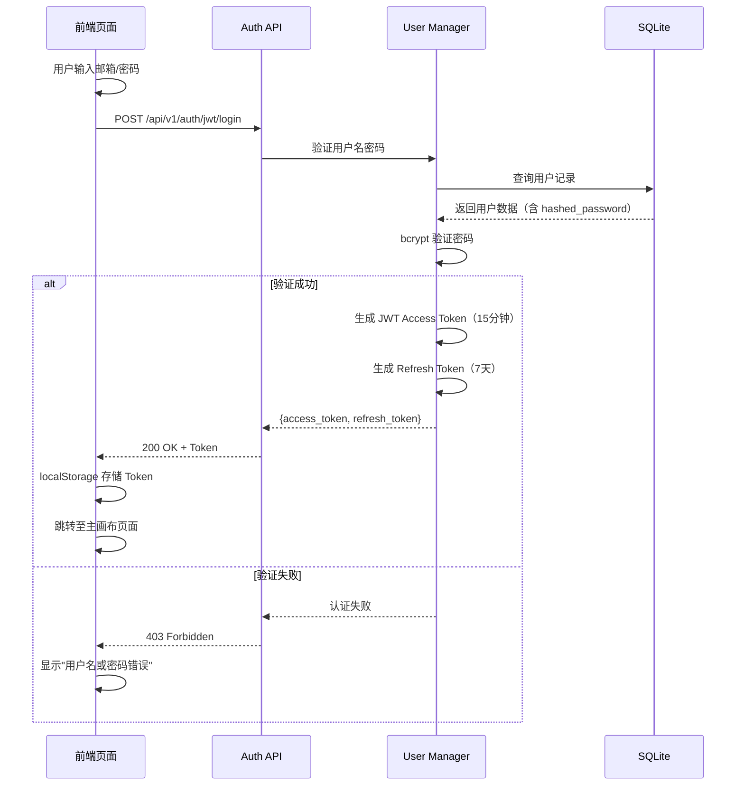

**Token 刷新机制**：
- Access Token 有效期 15 分钟，前端在每次请求前检查过期时间
- 当 Access Token 剩余有效期 < 5 分钟时，自动调用 `/api/v1/auth/jwt/refresh`
- Refresh Token 有效期 7 天，过期后需重新登录

### 2.2 注册流程

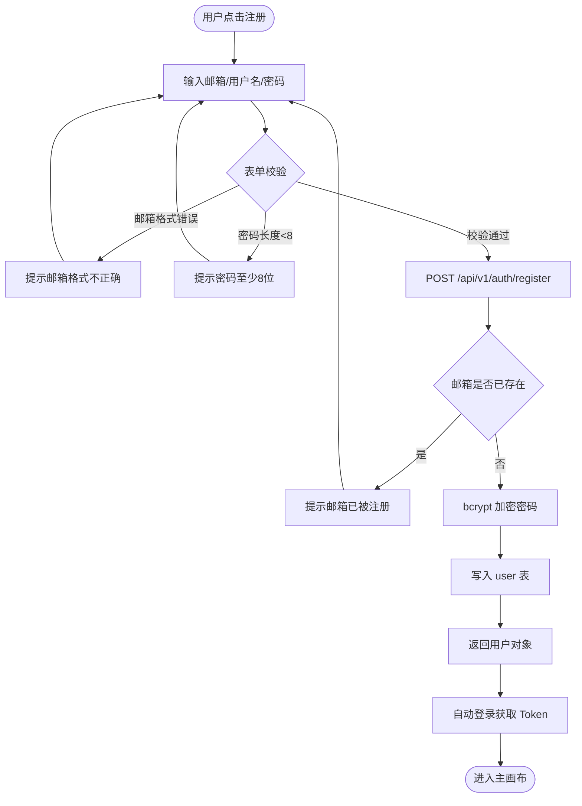

### 2.3 API 请求鉴权流程

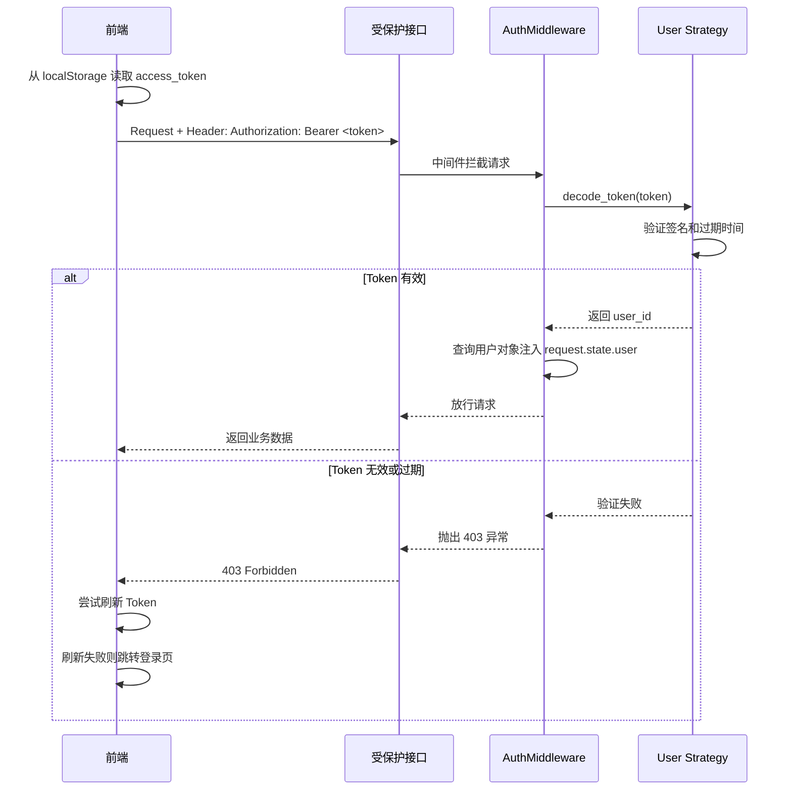

---


## 3. 精细编排节点流程

### 3.1 撤销/重做流程

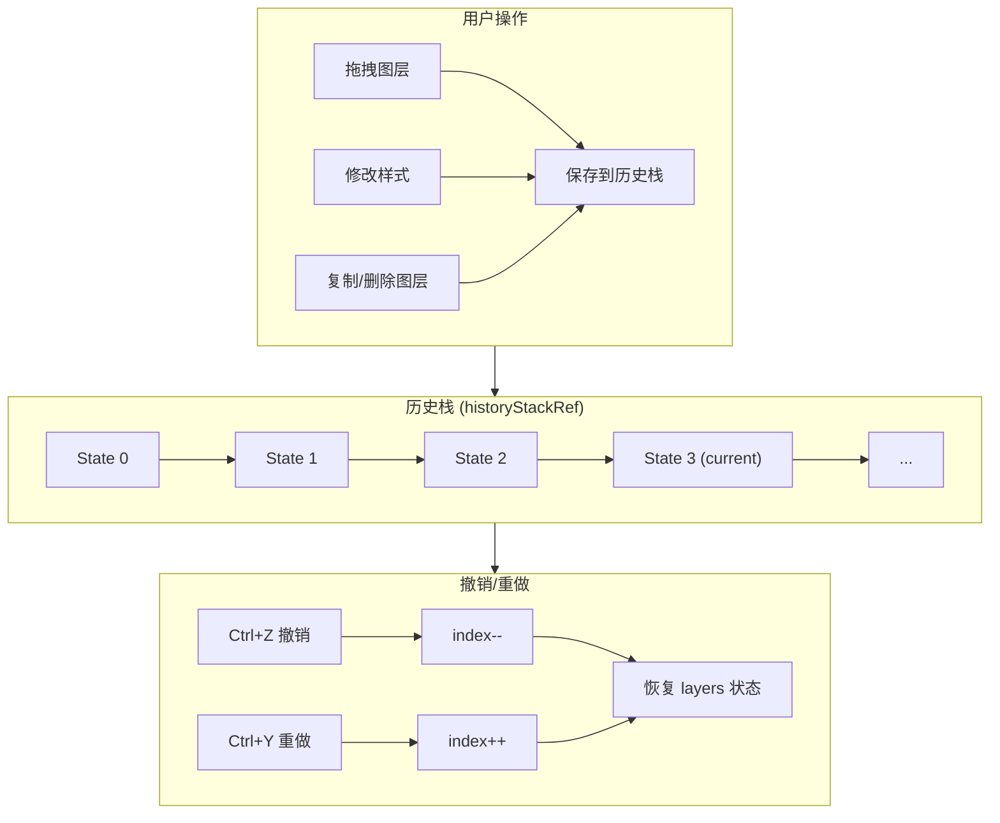

**撤销/重做详细流程**：

1. **保存历史时机**：
   - 拖拽结束（mouseup）
   - 样式修改完成（onChange）
   - 图层增删（复制/删除/新建）
   - 分页切换前

2. **历史状态结构**：
```typescript
interface HistoryState {
    layers: Layer[];           // 图层深拷贝
    timestamp: number;         // 时间戳
}
```

3. **关键实现逻辑**：
```javascript
// 保存到历史
const saveToHistory = (layersToSave) => {
    if (isUndoingRef.current) return;  // 撤销操作本身不记录
    
    // 截断未来的历史（如果在中间状态）
    if (historyIndexRef.current < historyStackRef.current.length - 1) {
        historyStackRef.current = historyStackRef.current.slice(0, historyIndexRef.current + 1);
    }
    
    // 去重检查
    const lastState = historyStackRef.current[historyStackRef.current.length - 1];
    if (JSON.stringify(lastState.layers) === JSON.stringify(layersToSave)) {
        return;  // 状态相同不保存
    }
    
    // 压入新状态
    historyStackRef.current.push({
        layers: JSON.parse(JSON.stringify(layersToSave)),
        timestamp: Date.now()
    });
    historyIndexRef.current++;
    
    // 限制历史栈大小
    if (historyStackRef.current.length > MAX_HISTORY_SIZE) {
        historyStackRef.current.shift();
        historyIndexRef.current--;
    }
};

// 撤销
const undo = () => {
    if (historyIndexRef.current <= 0) return;  // 没有可撤销的
    
    isUndoingRef.current = true;
    historyIndexRef.current--;
    const previousState = historyStackRef.current[historyIndexRef.current];
    
    // 恢复图层状态
    updateNodeData({
        isDirty: true,
        content: { layers: previousState.layers }
    });
    
    setTimeout(() => { isUndoingRef.current = false; }, 0);
};
```

### 3.2 图层编辑流程

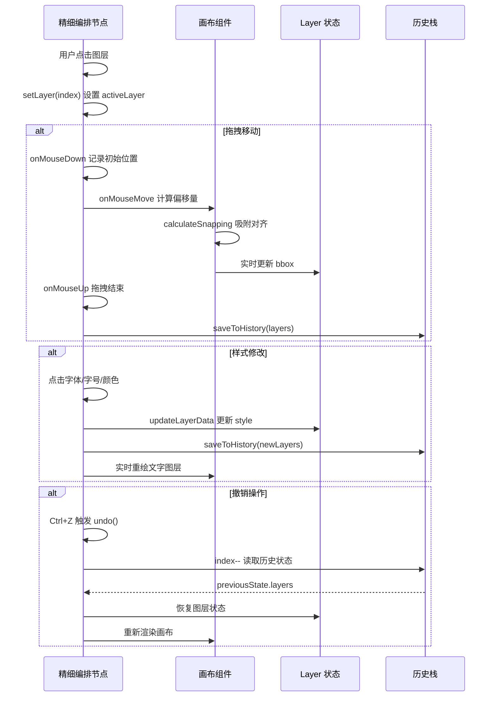

### 3.3 分页与批量导出流程

```mermaid
flowchart TD
    A[上游输入 items] --> B{items.length > itemsPerPage?}
    B -->|是| C[计算总页数: ceil(items/itemsPerPage)]
    B -->|否| D[单页显示]
    C --> E[当前页: currentPage]
    
    E --> F[LayoutUtils.mapContentToLayers]
    F --> G[应用 pageOverrides]
    G --> H[渲染当前页图层]
    
    H --> I{切换页面?}
    I -->|是| J[保存当前页覆写样式]
    J --> K[currentPage++]
    K --> F
    
    H --> L[点击批量导出]
    L --> M[for page in 0..totalPages]
    M --> N[setPage(page)]
    N --> O[等待 800ms 渲染]
    O --> P[html-to-image 截图]
    P --> Q[触发浏览器下载]
    Q --> M
```

### 3.4 项目自动保存与恢复流程

```mermaid
flowchart TD
    subgraph 初始化
        A[前端 app.js mount] --> B{localStorage 有 projectId?}
        B -->|是| C[GET /api/v1/projects/{id}]
        B -->|否| D[GET /api/v1/projects/last/active]
        C --> E{项目存在?}
        D --> E
        E -->|是| F[setNodes / setEdges / setViewport]
        E -->|否| G[创建空白画布]
        F --> H[渲染 ReactFlow 画布]
        G --> H
    end

    subgraph 自动保存
        I[nodes/edges/viewport 变化] --> J[2秒防抖定时器]
        J --> K{当前有项目?}
        K -->|是| L[PUT /api/v1/projects/{id}]
        K -->|否| M[POST /api/v1/projects/ 创建新项目]
        M --> N[localStorage 记录 projectId]
        L --> O[记录 CanvasActionLog]
        M --> O
        O --> P[返回项目摘要]
    end

    subgraph 多项目管理
        Q[用户点击「我的项目」] --> R[GET /api/v1/projects/]
        R --> S[展示项目卡片列表]
        S --> T{用户操作?}
        T -->|切换项目| U[setProjectId + 重新加载画布]
        T -->|新建项目| V[清空画布 + POST 新项目]
        T -->|删除项目| W[DELETE /api/v1/projects/{id}]
        U --> X[自动跳转到画布 Tab]
        V --> X
    end

    H --> I
```

**关键流程说明**：

1. **刷新恢复**：
   - 优先使用 `localStorage` 缓存的 `projectId`
   - 若无缓存，调用 `GET /projects/last/active` 获取最近项目
   - 恢复时完整加载 `nodes`、`edges`、`viewport`

2. **自动保存策略**：
   - 画布状态变化后触发 2 秒防抖
   - 首次保存时若用户无项目，自动创建「未命名项目」
   - 保存时同时记录 `CanvasActionLog`（`action_type=canvas_save`）
   - 保存失败不影响用户继续编辑（静默失败）

3. **多项目切换**：
   - 切换项目后自动跳转至「画布」Tab
   - 删除项目为软删除（`is_deleted="1"`）
   - 项目卡片展示缩略图（从 nodes 中提取第一张图片 URL）

---

## 4. 内容生产端到端流程

### 4.1 工作流模式（画布操作）

```mermaid
flowchart TD
    Start([用户打开 Magnes Studio]) --> A[在画布上创建节点]
    A --> B{需求类型}
    B -->|有商品图| C[拖入 InputImage 节点，上传商品图]
    B -->|有参考风格| D[拖入 InputImage 节点，上传参考图]
    B -->|纯文案生成| E[拖入 ContentNode 节点]

    C --> F[连接 Slicer 节点]
    D --> G[连接 Refiner 节点]
    F --> H[连接 Painter 节点]
    G --> H
    H --> I[连接 Composer 节点]
    E --> I

    I --> J[选择排版模版]
    J --> K[配置节点参数（风格、尺寸、文案方向）]
    K --> L[点击"生成"按钮]
    L --> M[POST /api/v1/tasks/run]
    M --> N[SSE 实时推送进度]
    N --> O{生成完成?}
    O -->|是| P[预览生成结果]
    O -->|失败| Q[查看错误信息，调整参数重试]
    P --> R{满意?}
    R -->|是| S[点击"导出"，下载 PNG]
    R -->|否| T[调整参数或文案，重新生成]
    T --> L
    S --> End([内容生产完成])
```

### 4.2 对话模式（自然语言驱动）

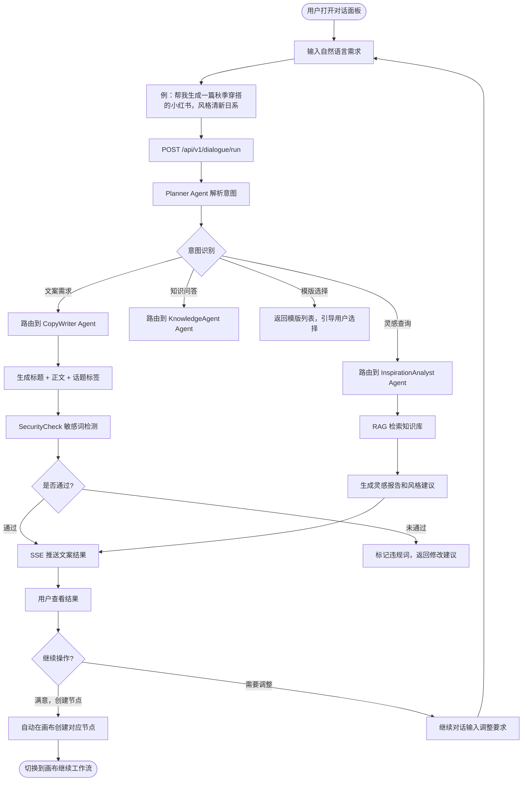

### 4.3 多智能体协作流程（层级结构）

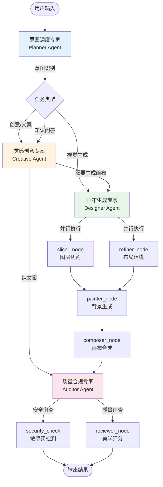

**多智能体协作流程说明**：

1. **意图调度专家 (Planner)** 作为指挥中心，接收用户输入并进行意图识别
2. 根据意图类型，动态路由到不同的专业专家：
   - 创意/文案需求 → **灵感创意专家 (Creative)**
   - 视觉生成需求 → **画布生成专家 (Designer)**
3. **灵感创意专家** 可独立产出文案，或触发画布生成流程
4. **画布生成专家** 内部采用并行处理：
   - `slicer_node` 和 `refiner_node` 可同时执行
   - 两者结果在 `painter_node` 汇合
5. 最终产出交由 **质量合规专家 (Auditor)** 进行双重审查：
   - `security_check` 进行安全合规审查
   - `reviewer_node` 进行美学质量评分

---

## 5. Fast Path 决策流程

```mermaid
flowchart TD
    Start([用户消息输入]) --> A{Fast Path 检测}

    A -->|包含结构化字段<br/>时间:/地点:/门票:| B[结构化数据 Fast Path]
    A -->|格式: [技能指令] 确认选择模版:| C[UI Command Fast Path]
    A -->|纯数字回复| D[数字选择 Fast Path]
    A -->|activeTab=xhs| E[页签上下文感知]
    A -->|无匹配| F[LLM 意图识别]

    B --> G[直接获取模版元数据]
    G --> H[构建模版选择列表]
    H --> I[SSE 推送模版选项]

    C --> J[提取模版 ID]
    J --> K[直接创建节点]
    K --> L[SSE 推送创建结果]

    D --> M[数字映射到选项]
    M --> N[执行对应操作]
    N --> L

    E --> O[xhs 页签]
    E --> P[canvas 页签]
    O --> Q[禁止电商技能触发]
    P --> R[允许所有技能]

    F --> S[LLM 推理解析意图]
    S --> T{幻觉检测}
    T -->|chat action + 分析关键词| U[修正为 analyze_inspiration]
    T -->|正常| V[按 action 路由]

    I --> End([返回结果])
    L --> End
    Q --> End
    R --> End
    U --> End
    V --> End
```

**Fast Path 触发条件**：

| 类型 | 触发条件 | 处理逻辑 |
|------|----------|----------|
| 结构化数据 | 消息包含 "时间:", "地点:", "门票:" 等字段且长度 > 50 | 直接调用 `get_available_templates_metadata()` 返回模版列表 |
| UI Command | 消息匹配 `[技能指令] 确认选择模版: {id}` | 直接提取 id 创建对应节点 |
| 数字选择 | 消息为纯数字（1-9） | 映射到对应索引的模版或选项 |
| 页签感知 | `activeTab` 参数为 xhs | 过滤掉电商相关技能，仅展示小红书相关功能 |

---

## 6. LangGraph 节点执行流程

### 6.1 Designer 工作流状态图

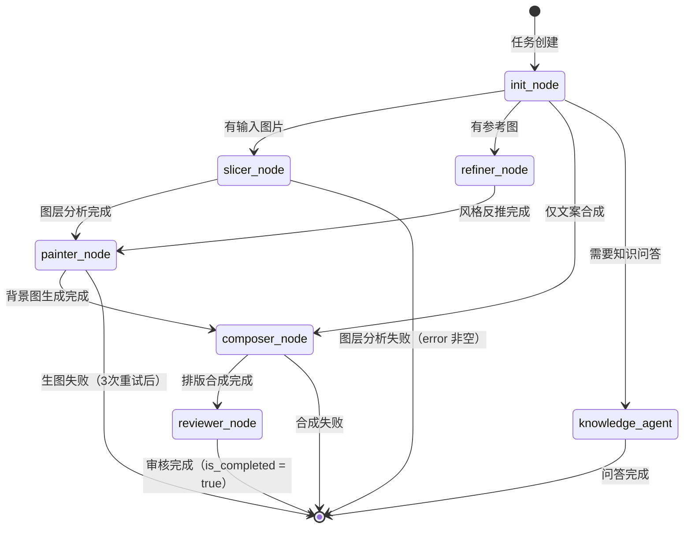

### 6.2 Planner 对话图状态

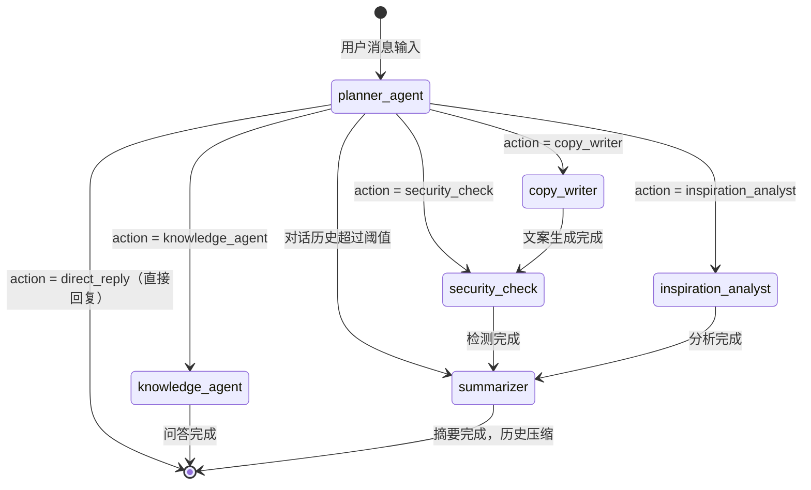

### 6.3 Skill 三阶段工作流（以电商生图为例）

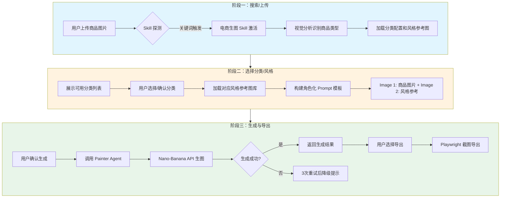

**Skill 标准交互流程**：

1. **阶段一：搜索/上传**
   - 用户通过对话触发（如输入 "1" 或 "电商生图"）
   - 或上传商品图片，系统自动识别激活 Skill
   - `skills_loader.py` 加载 `SKILL.md` 和 `categories.md`

2. **阶段二：选择/配置**
   - 展示分类选项（美妆/食品/电子/等）
   - 用户选择后加载对应风格参考图
   - 构建标准化 Prompt 模板（Image 1 + Image 2 格式）

3. **阶段三：生成/导出**
   - 调用 Designer 工作流生成图片
   - 支持一键导出到本地或发布到小红书

---

## 7. 任务状态生命周期

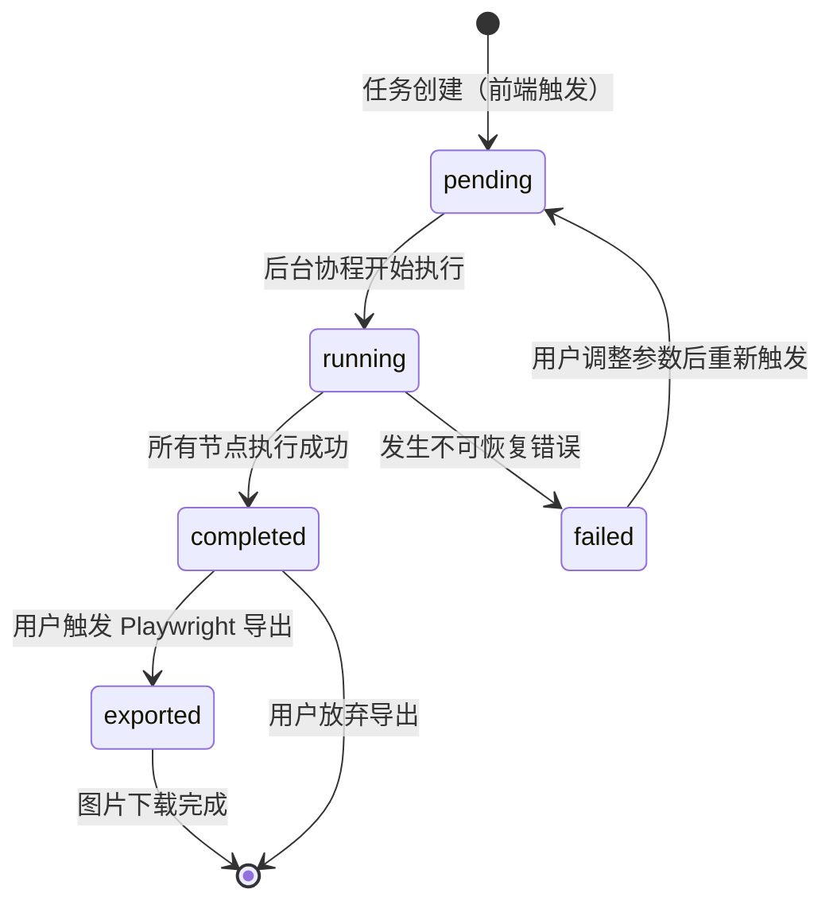

**状态说明**：

| 状态 | 描述 | 前端展示 |
|------|------|----------|
| `pending` | 任务已创建，等待执行 | 转圈动画 |
| `running` | 正在执行，SSE 推送进度 | 进度条 + 当前 Agent 名称 |
| `completed` | 所有节点完成，可预览和导出 | 绿色完成标记，显示结果 |
| `failed` | 执行失败 | 红色错误标记，显示错误原因 |
| `exported` | 已通过 Playwright 导出为图片 | 下载完成提示 |

---

## 8. 外部 AI 服务调用流程

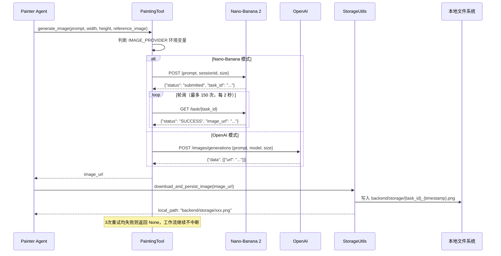

---

## 9. 灵感分析完整流程

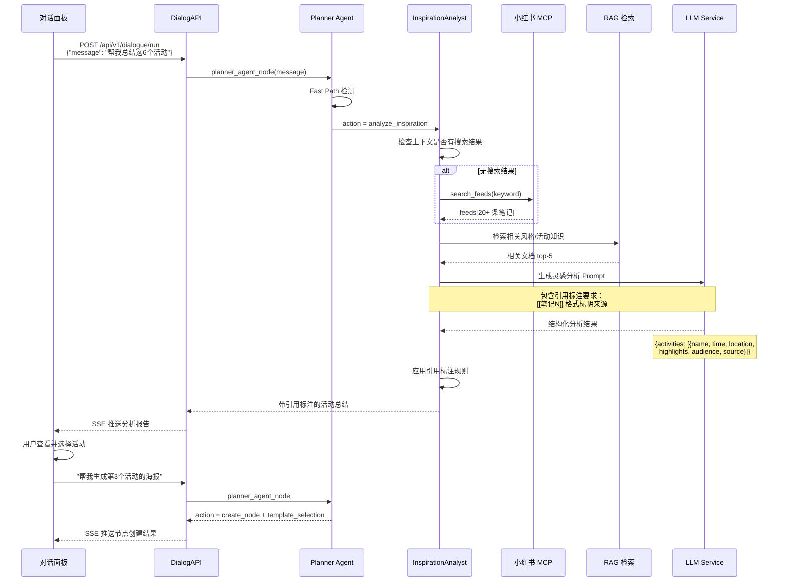

**灵感分析关键步骤**：

1. **上下文检查**：检查对话历史中是否有小红书搜索结果
2. **数据采集**：如无结果，自动调用 `search_feeds` 获取笔记列表
3. **RAG 增强**：检索知识库中的相关风格和活动信息
4. **LLM 分析**：生成结构化活动总结，包含引用标注
5. **引用规则**：使用 `[[笔记N]]` 格式标明信息来源
6. **后续操作**：用户可直接选择活动触发海报生成

---

## 10. RAG 知识库摄入与检索流程

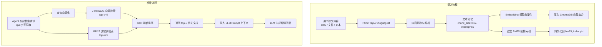

---

## 11. 图片导出流程

```mermaid
flowchart TD
    A[用户点击"导出"按钮] --> B[前端读取 composed_html from MagnesState]
    B --> C[POST /api/v1/export/image\n{html, width, height}]
    C --> D[image_generator.py: 启动 Playwright]
    D --> E[page.set_content(html)]
    E --> F[等待字体和图片资源加载完成\npage.wait_for_load_state]
    F --> G[page.screenshot\n{type:png, clip:{x,y,width,height}}]
    G --> H[PNG 二进制数据]
    H --> I[写入 exports/{task_id}_{timestamp}.png]
    I --> J[更新 GenerationHistory.export_path]
    J --> K[返回 {url, file_size}]
    K --> L[前端触发浏览器下载]
    L --> M([用户获得 PNG 图片])
```

---

## 12. OpenClaw Skill 对接流程

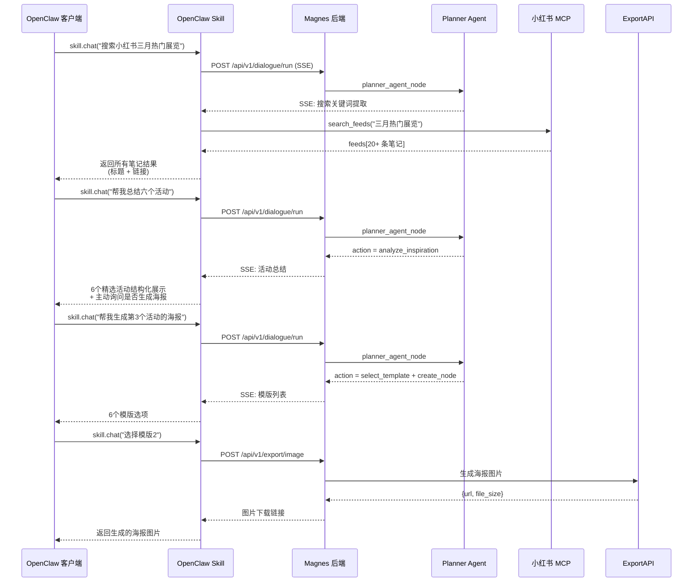

**OpenClaw Skill 特点**：

1. **独立封装**：完全不改动 Magnes 原项目代码，仅通过 API 对接
2. **直接 MCP 调用**：Skill 直接调用小红书 MCP（localhost:18060），不经过 Magnes 后端
3. **完整结果展示**：搜索返回所有结果（通常 20+ 条），不限制数量
4. **三阶段标准流程**：
   - 阶段一：搜索灵感（返回完整笔记列表）
   - 阶段二：总结活动（结构化展示 + 主动询问）
   - 阶段三：选择模版并生成海报

**对接 API**：

| 端点 | 用途 |
|------|------|
| `POST /api/v1/dialogue/run` | Magnes 对话流（SSE） |
| `POST /api/v1/export/image` | 海报图片生成 |
| `POST /api/v1/feeds/search` | 小红书搜索（直接 MCP） |
| `POST /api/v1/feeds/detail` | 笔记详情获取（直接 MCP） |

---

## 13. 运维与异常处理流程

```mermaid
flowchart TD
    A[监控告警触发] --> B{问题类型判断}

    B -->|API 路由 503| C[检查 Uvicorn 进程是否存活]
    C --> C1[重启 FastAPI 服务]

    B -->|LLM 调用超时| E[检查 LLM Provider 网络连通性]
    E --> E1[切换备用 Provider]

    B -->|SQLite 写入失败| F[检查磁盘空间]
    F --> F1{磁盘是否已满?}
    F1 -->|是| F2[清理过期生成历史和图片文件]
    F1 -->|否| F3[检查文件权限和数据库锁]

    B -->|Playwright 截图失败| G[检查 Chromium 是否已安装]
    G --> G1[执行 playwright install chromium]

    B -->|RAG 检索返回空| H[检查 ChromaDB 集合是否有数据]
    H --> H1[触发数据重新摄入]
```

---

## 14. 运营关注流程

### 14.1 内容质量监控

1. **生成历史审计**：通过 `GET /api/v1/history` 查看所有生成任务，检查文案质量和图片效果。
2. **敏感词命中统计**：分析 `SecurityCheck` 结果，优化敏感词库。
3. **模版使用统计**：统计各模版被选择次数，识别高频模版，优化设计。
4. **人工干预**：对不满意的生成结果，可手动编辑 HTML 后重新触发 Playwright 导出。

### 9.2 性能监控

1. **Agent 执行耗时**：通过日志统计各 Agent 的 P50/P99 执行时长。
2. **外部 API 成功率**：监控LLM调用成功率，低于 95% 时告警。
3. **RAG 检索质量**：统计检索结果的相关性，定期评估知识库质量。
4. **轮询超时率**：监控生图任务轮询超过阈值的比例，识别 API 稳定性问题。

---

## 15. SLA 与告警建议

| 指标 | 目标值 | 告警阈值 |
|------|--------|----------|
| Designer 工作流完成率 | ≥ 95% | < 90% |
| 平均生成时长（完整工作流） | ≤ 5 分钟 | > 8 分钟 |
| 外部生图 API 成功率 | ≥ 95% | < 90% |
| Planner 意图识别准确率 | ≥ 85% | < 75% |
| **Fast Path 触发率** | ≥ 40% | < 20% |
| **Fast Path 响应时间** | ≤ 100ms | > 500ms |
| SSE 连接中断后成功重连率 | ≥ 98% | < 95% |
| Playwright 导出成功率 | ≥ 99% | < 97% |
| RAG 检索 P99 响应时间 | ≤ 500ms | > 1000ms |
| 敏感词检测误报率 | ≤ 2% | > 5% |

**告警触发场景**：
- 生图 API 连续 5 次调用失败。
- LLM 调用 P99 > 60 秒持续 10 分钟。
- SQLite 写入错误（任何错误立即告警）。
- Playwright 截图失败（任何错误立即告警）。
- ChromaDB 检索返回空结果连续 3 次（可能数据库损坏）。
- **小红书 MCP 连接失败**：REST API 降级也失败，持续 1 分钟。
- **xsec_token 失效率**：详情获取失败率 > 30%。
- **Skill 加载失败**：`skills_loader.py` 扫描异常或 SKILL.md 解析错误。
- **Fast Path 异常**：触发 Fast Path 但处理失败率 > 5%。

