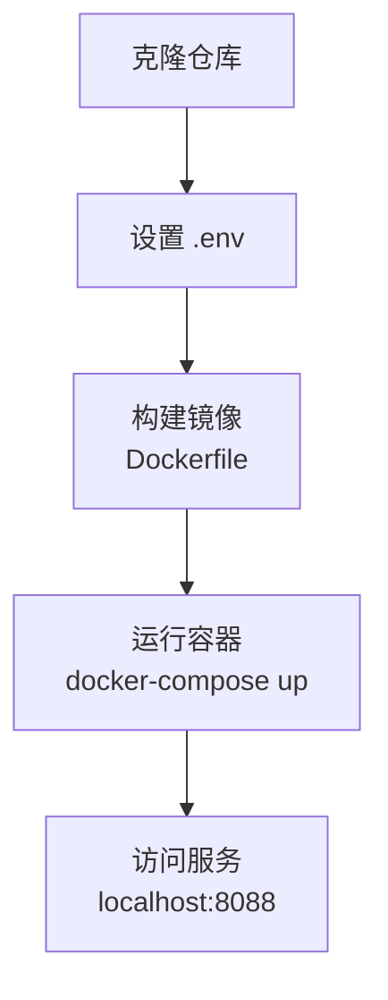

# Magnes Studio - 部署与运维文档

## 1. 部署目标

提供标准化、可重复的部署方案，支持从开发者本机单机运行到企业私有化部署的完整路径，保证各环境的一致性与可观测性。

## 2. 环境规划

| 环境 | 用途 | 特点 |
|------|------|------|
| Dev（本机） | 开发调试，快速迭代 | SQLite 本地文件，直接运行 Python，前端直接打开 HTML |
| Staging | 集成测试，验收新功能 | Docker Compose 部署，真实 API Key，模拟生产数据量 |
| Prod（生产） | 正式运行，对内/对外提供服务 | Docker Compose / K8s，HTTPS，API 鉴权，监控告警全开 |

### 2.1 必备依赖

| 依赖 | 版本要求 | 说明 |
|------|----------|------|
| Python | 3.10+ | 后端运行时 |
| Node.js | 18+（可选） | 仅用于前端 Babel 编译 JSX |
| Playwright Chromium | 最新稳定版 | 服务端截图导出（`playwright install chromium`） |

### 2.2 环境变量清单

| 变量名 | 必填 | 说明 |
|--------|------|------|
| `OPENAI_API_KEY` | ✅ | OpenAI 兼容接口 API Key（LLM 调用） |
| `OPENAI_BASE_URL` | 可选 | 自定义 LLM 接口地址（如 DeepSeek、本地 Ollama） |
| `OPENAI_MODEL` | 可选 | 使用的模型名称（默认 `gpt-4o`） |
| `QWEN_API_KEY` | 可选 | 通义千问 API Key（Slicer/Refiner 视觉分析） |
| `DATABASE_URL` | 可选 | 数据库连接字符串（默认 `sqlite+aiosqlite:///./magnes.db`） |
| `CHROMA_DB_PATH` | 可选 | ChromaDB 存储目录（默认 `./chroma_db`） |
| `STORAGE_PATH` | 可选 | 图片持久化目录（默认 `./storage`） |
| `EXPORT_PATH` | 可选 | 导出图片目录（默认 `./exports`） |
| `API_TOKEN` | ⚠️ 生产必填 | 后端 API 鉴权 Token |
| `CORS_ORIGINS` | ⚠️ 生产必填 | 允许的前端域名，逗号分隔 |
| `LOG_LEVEL` | 可选 | 日志级别（默认 `INFO`） |
| `MAX_CONCURRENT_TASKS` | 可选 | 最大并发生成任务数（默认 `5`） |

---

## 3. 本地开发部署（Dev）

### 3.1 快速启动

```bash
# 1. 克隆仓库
git clone <repo-url>
cd magnes

# 2. 配置环境变量
cp backend/.env.example backend/.env
# 编辑 .env，填入 OPENAI_API_KEY 

# 3. 安装 Python 依赖
cd backend
pip install -r requirements.txt

# 4. 安装 Playwright 浏览器（导出功能需要）
playwright install chromium

# 5. 初始化数据库（首次运行）
python -c "from app.core.database import init_db; import asyncio; asyncio.run(init_db())"

# 6. 启动后端
uvicorn app.main:app --reload --host 0.0.0.0 --port 8088

# 7. 打开前端（新终端）
# 直接在浏览器中打开 frontend/index.html
open frontend/index.html
# 或使用 Python 简单 HTTP Server 托管
python -m http.server 3000 --directory frontend
```

### 3.2 前端 JSX 编译（开发阶段修改源码后需执行）

```bash
# 安装 Babel 编译依赖
npm install

# 单次编译
npm run build

# 监听模式（自动重编译）
npm run build:watch
```

---

## 4. 配置与 Secrets 管理

- **开发环境**：`.env` 文件（已在 `.gitignore` 中排除，不提交代码仓库）。
- **Staging/Prod**：通过 CI/CD 系统的 Secrets（如 GitHub Secrets、GitLab CI Variables）注入环境变量；或使用云端 Secrets Manager（阿里云 KMS、AWS Secrets Manager）。
- **API Key 最小权限**：OpenAI Key 仅开放必要 API（`/chat/completions`、`/images/generations`），关闭 fine-tuning 等高危权限。

---

## 5. 安全与合规

- **HTTPS**：生产环境必须使用 HTTPS，通过 Nginx + Let's Encrypt 或云端 SSL 证书。
- **API 鉴权**：所有 `/api/v1/*` 路由添加 Bearer Token 验证（`API_TOKEN` 环境变量配置）。
- **CORS 白名单**：`CORS_ORIGINS` 精确配置允许域名，禁止 `*` 和 `null`。
- **文件上传限制**：限制上传图片大小 ≤ 20MB，检查 MIME 类型，防止恶意文件上传。
- **速率限制**：对 `/api/v1/tasks/run` 和 `/api/v1/dialogue/run` 添加速率限制（如每用户每分钟最多 10 次）。

---

## 6. Docker 容器化部署

### 6.1 容器镜像架构

项目采用单容器部署模式，后端 FastAPI 与前端静态文件统一打包：



### 6.2 Dockerfile 详解

**基础镜像**：`python:3.11-slim`

**关键步骤**：
1. **系统依赖安装**：Playwright 需要的 Chromium 浏览器依赖（libatk、libgtk、fonts 等）
2. **Python 依赖**：从 `requirements.txt` 安装 FastAPI、LangGraph、Playwright 等
3. **目录结构**：
   - `/app` - 后端代码
   - `/frontend` - 前端静态文件（关键：挂载到根目录，非 /app/frontend）
   - `/app/data` - 数据持久化目录（上传文件、数据库、导出图片）
4. **暴露端口**：8088
5. **启动命令**：`uvicorn main:app --host 0.0.0.0 --port 8088`

**Dockerfile 示例**：
```dockerfile
FROM python:3.11-slim

WORKDIR /app

# 安装系统依赖（Playwright Chromium 需要）
RUN apt-get update && apt-get install -y \
    wget gnupg libatk1.0-0 libatk-bridge2.0-0 libgdk-pixbuf-2.0-0 \
    libgtk-3-0 libgbm-dev libnss3 libxss1 libasound2 fonts-liberation \
    libappindicator3-1 libu2f-udev xdg-utils curl \
    && rm -rf /var/lib/apt/lists/*

# 安装 Python 依赖
COPY backend/requirements.txt .
RUN pip install --no-cache-dir -r requirements.txt

# 创建数据目录
RUN mkdir -p data/uploads exports chroma_db storage

# 复制后端代码
COPY backend /app

# 复制前端静态文件（关键：挂载到 /frontend）
COPY frontend /frontend

EXPOSE 8088

CMD ["uvicorn", "main:app", "--host", "0.0.0.0", "--port", "8088"]
```

### 6.3 Docker Compose 配置

```yaml
version: '3.8'

services:
  backend:
    build: 
      context: .
      dockerfile: Dockerfile
    ports:
      - "8088:8088"
    volumes:
      - ./frontend:/frontend          # 前端热更新（开发）
      - ./backend/data:/app/data      # 数据持久化
    environment:
      - HOST=0.0.0.0
      - PORT=8088
      - OPENAI_API_KEY=${OPENAI_API_KEY}
      - DATABASE_URL=sqlite+aiosqlite:///./data/magnes.db
    restart: always
```

### 6.4 容器部署步骤

**构建并启动**：
```bash
# 1. 构建镜像
docker-compose build

# 2. 启动服务
docker-compose up -d

# 3. 查看日志
docker-compose logs -f backend

# 4. 验证运行
curl http://localhost:8088/
```

**数据持久化说明**：
- SQLite 数据库：`./backend/data/magnes.db`
- 上传文件：`./backend/data/uploads/`
- 导出图片：`./backend/data/exports/`
- 向量库：`./backend/data/chroma_db/`

### 6.5 健康检查

后端提供根路径健康检查：
- **URL**：`GET /`
- **响应**：`{"status": "Magnes API is running", "engine": "LangGraph 1.0 (Async)"}`
- **容器健康检查**：可通过 `docker-compose` 的 `healthcheck` 配置定期检查

### 6.6 生产环境建议

| 建议项 | 说明 |
|--------|------|
| **镜像仓库** | 推送到企业私有镜像仓库（Harbor、阿里云 ACR） |
| **多实例部署** | 使用 Docker Swarm 或 K8s 部署多个后端实例 |
| **负载均衡** | Nginx 反向代理，配置 upstream 负载均衡 |
| **HTTPS** | Nginx 配置 SSL 证书，强制 HTTPS 访问 |
| **日志收集** | 配置日志驱动将容器日志发送到 ELK/EFK |
| **数据备份** | 定期备份 SQLite 数据库和上传文件目录 |


