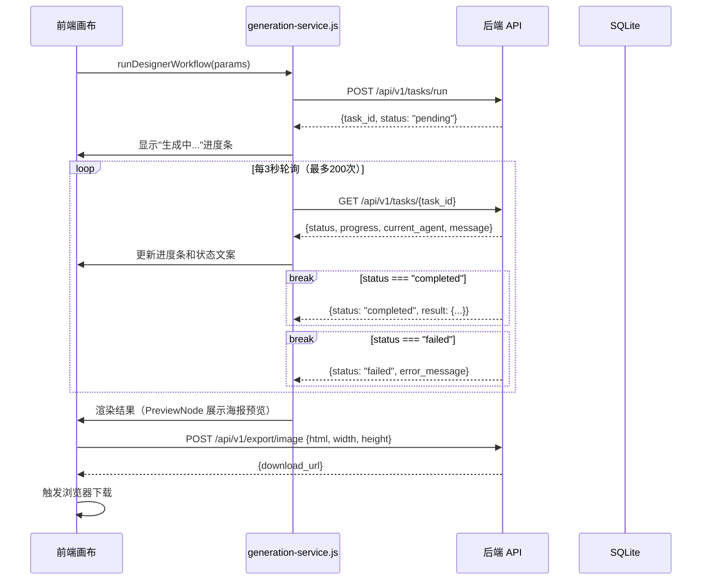
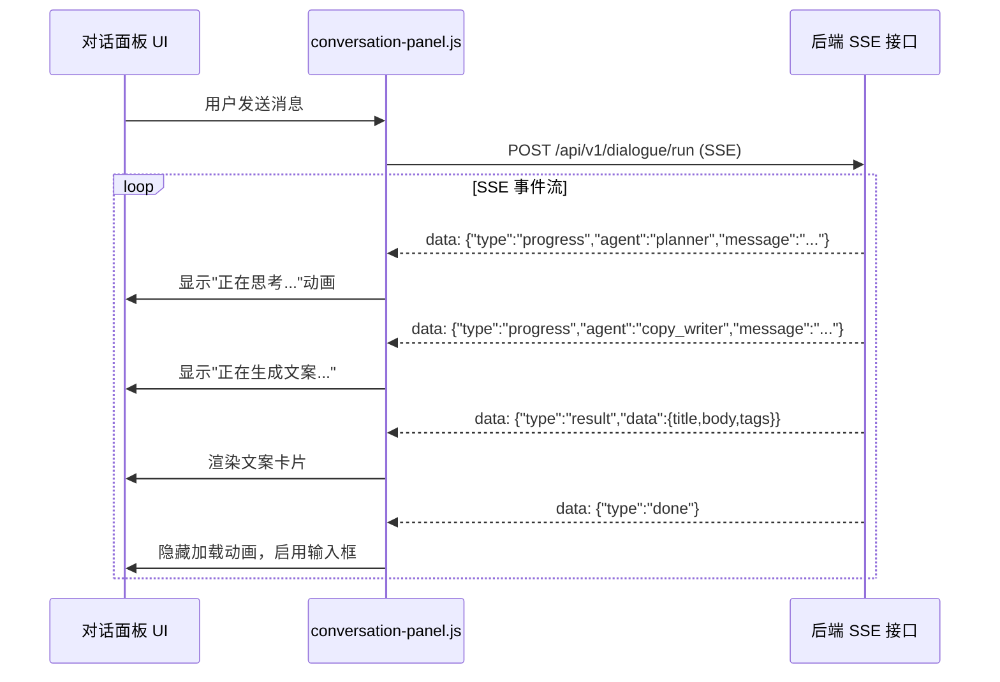

# Magnes Studio - 前端接口调用说明

## 1. 概述

本文档梳理 `frontend/src/` 下前端模块调用后端 REST API 与 SSE 接口的完整清单，涵盖调用时机、请求格式、响应结构、前端处理逻辑与错误处理。

**基础配置**：
- 后端 API 基础地址：`http://localhost:8088`（通过 `frontend/src/utils/constants.js` 的 `API_BASE_URL` 配置）
- 所有接口均为 JSON 格式（除 SSE 接口和文件下载）
- 认证：Bearer Token（`Authorization: Bearer <API_TOKEN>`），当前待实现

---

## 2. 接口总览

| 前端模块/函数 | 后端接口 | HTTP 方法 | 说明 |
|---------------|----------|-----------|------|
| `auth-service.js: login` | `/api/v1/auth/jwt/login` | POST | 用户登录（基础功能） |
| `auth-service.js: register` | `/api/v1/auth/register` | POST | 用户注册（基础功能） |
| `auth-service.js: refresh` | `/api/v1/auth/jwt/refresh` | POST | 刷新 Access Token |
| `generation-service.js: runDesignerWorkflow` | `/api/v1/tasks/run` | POST | 触发 Designer 多智能体工作流 |
| `generation-service.js: pollTaskStatus` | `/api/v1/tasks/{task_id}` | GET | 轮询任务状态（当前方案，建议改为 SSE） |
| `conversation-panel.js: sendMessage` | `/api/v1/dialogue/run` | POST (SSE) | 对话消息发送，SSE 实时接收回复 |
| `app.js: loadTemplates` | `/api/v1/templates/` | GET | 加载可用模版列表 |
| `stylelab-node.js: saveTemplate` | `/api/v1/templates/` | POST | 保存自定义模版 |
| `stylelab-node.js: updateTemplate` | `/api/v1/templates/{id}` | PUT | 更新现有模版 |
| `stylelab-node.js: deleteTemplate` | `/api/v1/templates/{id}` | DELETE | 删除模版 |
| `app.js: loadHistory` | `/api/v1/history/` | GET | 加载生成历史列表 |
| `preview-node.js: exportImage` | `/api/v1/export/image` | POST | 触发 Playwright 截图导出 |
| `rag 相关组件: ingestDocument` | `/api/v1/rag/ingest` | POST | 向 RAG 知识库摄入文档 |
| `rag 相关组件: searchKnowledge` | `/api/v1/rag/search` | POST | 检索 RAG 知识库 |
| `mcp 相关组件: callMCPTool` | `/api/v1/mcp/call` | POST | 调用 MCP 工具 |
| `semantic-service.js: analyze` | `/api/v1/prompt/analyze` | POST | Prompt 语义分析 |
| `painter-node.js: generateBackground` | `/api/v1/painter/generate/background` | POST | AI 生成背景图片 |
| `config-routes: getConfig` | `/api/v1/config` | GET | 获取系统配置 |
| `config-routes: updateConfig` | `/api/v1/config` | PUT | 更新系统配置 |
| `AppModals.js: loadSoulMd` | `/api/v1/memory/soul` | GET | 获取 Soul.md（偏好设定） |
| `AppModals.js: saveSoulMd` | `/api/v1/memory/soul` | POST | 保存/更新 Soul.md |
| `AppModals.js: loadMemoryMd` | `/api/v1/memory/memory` | GET | 获取 MEMORY.md（记忆索引） |
| `AppModals.js: saveMemoryMd` | `/api/v1/memory/memory` | POST | 保存/更新 MEMORY.md |
| `memory-routes: getPreferences` | `/api/v1/memory/preferences` | GET | 获取策展式记忆列表 |
| `memory-routes: createPreference` | `/api/v1/memory/preferences` | POST | 创建/更新单条记忆 |
| `memory-routes: updatePreference` | `/api/v1/memory/preferences/{id}` | PATCH | 更新记忆内容或置信度 |
| `memory-routes: deletePreference` | `/api/v1/memory/preferences/{id}` | DELETE | 删除单条记忆 |
| `memory-routes: getSummary` | `/api/v1/memory/summary` | GET | 获取 prompt-ready 记忆摘要 |
| `api-client.js: API.Project.list` | `/api/v1/projects/` | GET | 获取项目列表 |
| `api-client.js: API.Project.get` | `/api/v1/projects/{id}` | GET | 获取单个项目详情 |
| `api-client.js: API.Project.getLastActive` | `/api/v1/projects/last/active` | GET | 获取用户最近活跃项目 |
| `api-client.js: API.Project.create` | `/api/v1/projects/` | POST | 创建新项目 |
| `api-client.js: API.Project.update` | `/api/v1/projects/{id}` | PUT | 更新项目（自动保存） |
| `api-client.js: API.Project.delete` | `/api/v1/projects/{id}` | DELETE | 删除项目（软删除） |
| `api-client.js: API.Project.createSnapshot` | `/api/v1/projects/{id}/snapshots` | POST | 创建项目快照 |
| `api-client.js: API.Project.listSnapshots` | `/api/v1/projects/{id}/snapshots` | GET | 获取项目快照列表 |
| `api-client.js: API.ActionLog.log` | `/api/v1/projects/action-log` | POST | 记录画布操作日志 |
| `api-client.js: API.ActionLog.history` | `/api/v1/projects/action-log/history` | GET | 查询操作日志历史 |
| `api-client.js: API.Memory.analyze` | `/api/v1/projects/analyze-memory` | POST | 触发记忆回流分析 |
| `api-client.js: API.Memory.preview` | `/api/v1/projects/memory-analysis/preview` | GET | 预览记忆分析结果 |

---

## 3. 详细接口说明

### 3.1 用户登录

**触发时机**：用户打开应用，输入用户名密码后点击登录。

**接口**：`POST /api/v1/auth/jwt/login`

**请求体**（form-data）：
```
username=string
password=string
```

**响应**：
```json
{
  "access_token": "eyJhbGciOiJIUzI1NiIs...",
  "refresh_token": "eyJhbGciOiJIUzI1NiIs...",
  "token_type": "bearer"
}
```

**前端处理**：
```js
const formData = new FormData();
formData.append('username', email);
formData.append('password', password);

const response = await fetch(`${API_BASE_URL}/api/v1/auth/jwt/login`, {
    method: 'POST',
    body: formData
});
const { access_token, refresh_token } = await response.json();
localStorage.setItem('access_token', access_token);
localStorage.setItem('refresh_token', refresh_token);
```

---

### 3.2 用户注册

**触发时机**：新用户点击注册按钮。

**接口**：`POST /api/v1/auth/register`

**请求体**：
```json
{
  "email": "user@example.com",
  "username": "username",
  "password": "secure_password"
}
```

**响应**：返回创建的用户对象（不含密码）。

---

### 3.3 刷新 Token

**触发时机**：Access Token 即将过期（如剩余 5 分钟），自动调用刷新。

**接口**：`POST /api/v1/auth/jwt/refresh`

**请求头**：`Authorization: Bearer <refresh_token>`

**响应**：
```json
{
  "access_token": "eyJhbGciOiJIUzI1NiIs...",
  "token_type": "bearer"
}
```

---

### 3.4 触发 Designer 工作流

**触发时机**：用户点击 ReactFlow 画布上的"生成"按钮，或对话模式下 Planner 确认需求后自动触发。

**接口**：`POST /api/v1/tasks/run`

**请求体**：
```json
{
  "task_type": "designer",
  "params": {
    "input_image": "storage/xxx.png",
    "reference_image": "storage/yyy.png",
    "template_id": 3,
    "user_prompt": "秋季穿搭，清新日系风格",
    "style_prompt": "高饱和度，暖色调，自然光...",
    "generate_copy": true,
    "copy_direction": "秋季穿搭种草",
    "width": 1080,
    "height": 1440
  }
}
```

**响应**：
```json
{
  "task_id": "550e8400-e29b-41d4-a716-446655440000",
  "status": "pending",
  "created_at": "2026-03-22T10:30:00Z"
}
```

**前端处理**：
```js
// generation-service.js
const response = await fetch(`${API_BASE_URL}/api/v1/tasks/run`, {
    method: 'POST',
    headers: {
        'Content-Type': 'application/json',
        'Authorization': `Bearer ${apiToken}`
    },
    body: JSON.stringify(payload),
    signal: abortController.signal
});
const { task_id } = await response.json();
// 开始轮询任务状态
startPolling(task_id);
```

**超时**：60 秒

---

### 3.5 轮询任务状态

**触发时机**：触发 Designer 工作流后，每 3 秒轮询一次，直到状态变为 `completed` 或 `failed`。

**接口**：`GET /api/v1/tasks/{task_id}`

**响应示例（执行中）**：
```json
{
  "task_id": "550e8400-e29b-41d4-a716-446655440000",
  "status": "running",
  "progress": 60,
  "current_agent": "painter",
  "message": "正在生成背景图片...",
  "created_at": "2026-03-22T10:30:00Z"
}
```

**响应示例（完成）**：
```json
{
  "task_id": "550e8400-e29b-41d4-a716-446655440000",
  "status": "completed",
  "progress": 100,
  "current_agent": null,
  "message": "生成完成",
  "result": {
    "composed_html": "<div class='poster'>...</div>",
    "copy": {
      "title": "🍂秋日穿搭指南｜这样穿显瘦又好看",
      "body": "最近天气变凉了...",
      "tags": ["#秋季穿搭", "#OOTD", "#穿搭分享"]
    },
    "generated_background": "/storage/bg_550e8400.png",
    "layers": [...]
  },
  "execution_time_ms": 43210,
  "created_at": "2026-03-22T10:30:00Z",
  "completed_at": "2026-03-22T10:30:43Z"
}
```

**响应示例（失败）**：
```json
{
  "task_id": "550e8400-e29b-41d4-a716-446655440000",
  "status": "failed",
  "error_message": "生图 API 调用失败",
  "progress": 40
}
```

**前端轮询逻辑**：
```js
// 建议修复（当前存在无限循环风险）
const MAX_RETRIES = 200; // 最多轮询 200 次（约 10 分钟）
let retries = 0;

while (retries++ < MAX_RETRIES) {
    if (signal?.aborted) throw new Error('用户取消');

    const res = await fetch(`${API_BASE_URL}/api/v1/tasks/${task_id}`);
    const data = await res.json();

    if (data.status === 'completed') return data.result;
    if (data.status === 'failed') throw new Error(data.error_message);

    // 更新进度条
    onProgress?.(data.progress, data.current_agent, data.message);

    await new Promise(r => setTimeout(r, 3000)); // 每 3 秒轮询
}
throw new Error('任务超时，请检查后端服务状态');
```

---

### 3.6 对话消息发送（SSE）

**触发时机**：用户在对话面板输入消息并发送。

**接口**：`POST /api/v1/dialogue/run`（返回 `text/event-stream`）

**请求体**：
```json
{
  "message": "帮我写一篇秋季穿搭的小红书文案，风格活泼可爱",
  "session_id": "session-abc123",
  "context": {
    "current_template_id": 3,
    "canvas_nodes": ["inputImage-1", "composer-1"]
  }
}
```

**SSE 事件流格式**：
```
data: {"type": "progress", "agent": "planner", "message": "正在理解您的需求..."}

data: {"type": "progress", "agent": "copy_writer", "message": "正在生成文案..."}

data: {"type": "tool_call", "tool": "rag_search", "query": "秋季穿搭风格"}

data: {"type": "result", "data": {
  "title": "🍂秋日穿搭｜这样搭配超显瘦",
  "body": "最近天气越来越凉...",
  "tags": ["#秋季穿搭", "#穿搭分享", "#OOTD"],
  "call_to_action": "喜欢的话点赞收藏不迷路～"
}}

data: {"type": "done", "session_id": "session-abc123"}
```

**SSE 事件类型**：

| 事件类型 | 说明 | 前端处理 |
|----------|------|----------|
| `progress` | Agent 执行进度 | 显示当前步骤和提示信息 |
| `tool_call` | Agent 调用工具 | 显示工具调用信息（可选折叠） |
| `result` | 最终结果数据 | 渲染文案、图片、建议等 |
| `error` | 执行错误 | 显示错误提示，提供重试按钮 |
| `done` | 流式推送完成 | 关闭 SSE 连接，启用输入框 |

**前端 SSE 接收代码**：
```js
// conversation-panel.js
async function sendMessage(message, sessionId) {
    const response = await fetch(`${API_BASE_URL}/api/v1/dialogue/run`, {
        method: 'POST',
        headers: { 'Content-Type': 'application/json' },
        body: JSON.stringify({ message, session_id: sessionId })
    });

    const reader = response.body.getReader();
    const decoder = new TextDecoder();

    while (true) {
        const { done, value } = await reader.read();
        if (done) break;

        const lines = decoder.decode(value).split('\n');
        for (const line of lines) {
            if (!line.startsWith('data: ')) continue;
            const event = JSON.parse(line.slice(6));
            handleSSEEvent(event);
        }
    }
}
```

**超时**：无固定超时（流式连接，用户手动取消或收到 `done` 事件后关闭）

---

### 3.7 模版管理

**加载模版列表**

- **触发时机**：页面初始化时、StyleLab 节点打开时
- **接口**：`GET /api/v1/templates/?category=rednote&page=1&limit=20`
- **响应**：
```json
{
  "items": [
    {
      "id": 1,
      "name": "门票风",
      "description": "仿电影票/景区门票风格，复古感强",
      "thumbnail_url": "/storage/templates/ticket_thumb.png",
      "category": "rednote",
      "is_builtin": true
    }
  ],
  "total": 15,
  "page": 1,
  "limit": 20
}
```

**创建模版**

- **接口**：`POST /api/v1/templates/`
- **请求体**：`{ "name": "我的模版", "layout_json": {...}, "category": "rednote" }`
- **响应**：`{ "id": 16, "name": "我的模版", ... }`

**更新模版**

- **接口**：`PUT /api/v1/templates/{id}`
- **请求体**：需要更新的字段（部分更新）

**删除模版**

- **接口**：`DELETE /api/v1/templates/{id}`
- **约束**：内置模版（`is_builtin=true`）不可删除，返回 403

---

### 3.8 图片导出（Playwright 截图）

**触发时机**：用户在 PreviewNode 上点击"导出 PNG"按钮。

**接口**：`POST /api/v1/export/image`

**请求体**：
```json
{
  "task_id": "550e8400-e29b-41d4-a716-446655440000",
  "html": "<div class='poster' style='width:1080px;height:1440px'>...</div>",
  "width": 1080,
  "height": 1440,
  "scale": 2
}
```

**响应**：
```json
{
  "export_path": "exports/550e8400_20260322_103043.png",
  "download_url": "/exports/550e8400_20260322_103043.png",
  "file_size_bytes": 2457600,
  "width": 2160,
  "height": 2880
}
```

**前端处理**：
```js
// preview-node.js
const res = await fetch(`${API_BASE_URL}/api/v1/export/image`, {
    method: 'POST',
    headers: { 'Content-Type': 'application/json' },
    body: JSON.stringify({ task_id, html: composedHtml, width: 1080, height: 1440, scale: 2 })
});
const { download_url } = await res.json();

// 触发浏览器下载
const a = document.createElement('a');
a.href = `${API_BASE_URL}${download_url}`;
a.download = `magnes_${Date.now()}.png`;
a.click();
```

**超时**：120 秒（Playwright 渲染可能耗时较长）

---

### 3.9 生成历史查询

**触发时机**：用户打开历史记录面板时。

**接口**：`GET /api/v1/history/?page=1&limit=20&status=completed`

**响应**：
```json
{
  "items": [
    {
      "id": 42,
      "task_id": "550e8400-...",
      "copy_title": "🍂秋日穿搭｜这样搭配超显瘦",
      "status": "completed",
      "template_id": 3,
      "execution_time_ms": 43210,
      "created_at": "2026-03-22T10:30:00Z",
      "export_path": "exports/550e8400.png"
    }
  ],
  "total": 128,
  "page": 1,
  "limit": 20
}
```

---

### 3.10 RAG 知识库操作

**摄入文档**

- **接口**：`POST /api/v1/rag/ingest`
- **请求体**：`{ "source_type": "url", "content": "https://example.com/article", "category": "inspiration" }`
- **响应**：`{ "doc_id": "...", "chunks_created": 5, "status": "ingested" }`

**知识检索**

- **接口**：`POST /api/v1/rag/search`
- **请求体**：`{ "query": "清新日系穿搭风格特点", "top_k": 5, "category": "style_reference" }`
- **响应**：`{ "results": [{"content": "...", "score": 0.92, "source": "..."}, ...] }`

---

### 3.11 AI 生成背景图片

**触发时机**：用户在精细编排节点或 Painter 节点点击"AI 生成背景"。

**接口**：`POST /api/v1/painter/generate/background`

**请求体**：
```json
{
  "prompt": "秋季森林，暖色调，阳光透过树叶...",
  "aspect_ratio": "3:4",
  "reference_image": "http://.../reference.png",
  "reference_mode": "txt2img"
}
```

**响应**：
```json
{
  "url": "http://localhost:8088/uploads/generated_xxx.png",
  "width": 1024,
  "height": 1536
}
```

**前端处理**：
```js
const response = await fetch(`${API_BASE_URL}/api/v1/painter/generate/background`, {
    method: 'POST',
    headers: {
        'Content-Type': 'application/json',
        'Authorization': `Bearer ${accessToken}`
    },
    body: JSON.stringify({
        prompt: userPrompt,
        aspect_ratio: '3:4',
        reference_image: currentBgUrl,
        reference_mode: useReferenceImage ? 'img2img' : 'txt2img'
    })
});
const result = await response.json();
// 更新背景图层 URL
updateLayerData(bgLayerIdx, { url: result.url });
```

**超时**：120 秒（生图较慢）

---

### 3.12 获取系统配置

**触发时机**：应用启动时加载系统配置。

**接口**：`GET /api/v1/config`

**响应**：
```json
{
  "llm_provider": "openai",
  "model": "gpt-4o",
  "max_concurrent_tasks": 5,
  "features": {
    "rag_enabled": true,
    "mcp_enabled": true
  }
}
```

---

### 3.13 更新系统配置

**触发时机**：管理员修改系统设置。

**接口**：`PUT /api/v1/config`

**请求体**：
```json
{
  "max_concurrent_tasks": 10,
  "features": {
    "rag_enabled": false
  }
}
```

---

### 3.14 Soul.md / MEMORY.md 管理

**获取 Soul.md**

- **触发时机**：用户打开设置弹窗并切换到「偏好设置」Tab。
- **接口**：`GET /api/v1/memory/soul`
- **响应**：
```json
{
  "status": "success",
  "data": {
    "id": "uuid",
    "text": "我是一个母婴博主，风格温暖治愈。",
    "updatedAt": "2026-04-15T10:30:00Z"
  }
}
```

**保存 Soul.md**

- **触发时机**：用户在「偏好设置」Tab 中点击保存按钮。
- **接口**：`POST /api/v1/memory/soul`
- **请求体**：
```json
{
  "text": "我是一个母婴博主，风格温暖治愈。"
}
```
- **响应**：`{ "status": "success", "data": { ... } }`

**获取 MEMORY.md**

- **触发时机**：用户打开设置弹窗并切换到「记忆设置」Tab。
- **接口**：`GET /api/v1/memory/memory`
- **响应**：
```json
{
  "status": "success",
  "data": {
    "id": "uuid",
    "text": "- 常用模板：母婴活动海报（使用 12 次）",
    "updatedAt": "2026-04-15T10:30:00Z"
  }
}
```

**保存 MEMORY.md**

- **触发时机**：用户在「记忆设置」Tab 中点击保存按钮。
- **接口**：`POST /api/v1/memory/memory`
- **请求体**：
```json
{
  "text": "- 常用模板：母婴活动海报（使用 12 次）"
}
```
- **响应**：`{ "status": "success", "data": { ... } }`

**获取策展式记忆列表**

- **触发时机**：记忆管理面板加载时。
- **接口**：`GET /api/v1/memory/preferences?memory_type=preference`
- **响应**：
```json
{
  "status": "success",
  "data": [
    {
      "id": "uuid",
      "memoryType": "preference",
      "key": "主色调偏好",
      "content": { "value": "粉色系" },
      "confidence": 0.85,
      "evidence": "最近5个项目使用粉色背景",
      "updatedAt": "2026-04-19T10:30:00Z"
    }
  ]
}
```

**创建/更新记忆**

- **触发时机**：用户手动添加记忆，或记忆回流自动写入。
- **接口**：`POST /api/v1/memory/preferences`
- **请求体**：
```json
{
  "memory_type": "preference",
  "key": "主色调偏好",
  "content": { "value": "粉色系" },
  "confidence": 0.85,
  "evidence": "最近5个项目使用粉色背景"
}
```
- **行为**：同类型同 key 已存在时自动更新（upsert）。

**更新记忆**

- **触发时机**：用户修改某条记忆的内容或置信度。
- **接口**：`PATCH /api/v1/memory/preferences/{memory_id}`
- **请求体**：`{ "content": { "value": "暖色调" }, "confidence": 0.9 }`

**删除记忆**

- **触发时机**：用户删除某条记忆。
- **接口**：`DELETE /api/v1/memory/preferences/{memory_id}`

**前端处理**：
```js
// 设置面板打开时并行加载
const [soulRes, memoryRes] = await Promise.all([
    API.magnesFetch('/memory/soul', { triggerLogin: true }),
    API.magnesFetch('/memory/memory', { triggerLogin: true })
]);

// 保存 Soul.md
await API.magnesFetch('/memory/soul', {
    method: 'POST',
    triggerLogin: true,
    body: JSON.stringify({ text: soulMdValue })
});
```

### 3.15 项目持久化（Project）

**获取项目列表**

- **触发时机**：用户打开「我的项目」面板时。
- **接口**：`GET /api/v1/projects/`
- **响应**：
```json
{
  "status": "success",
  "data": [
    {
      "id": "proj_xxx",
      "name": "活动海报",
      "description": "",
      "thumbnailUrl": "/storage/generated_xxx.png",
      "updatedAt": "2026-04-19T10:30:00Z",
      "nodeCount": 5,
      "edgeCount": 4
    }
  ]
}
```

**获取最近活跃项目**

- **触发时机**：应用 mount 时自动加载，恢复上次编辑状态。
- **接口**：`GET /api/v1/projects/last/active`
- **响应**：单个 Project 对象（含完整 `nodes`、`edges`、`viewport`）

**创建项目**

- **触发时机**：用户点击「新建项目」按钮。
- **接口**：`POST /api/v1/projects/`
- **请求体**：
```json
{
  "name": "未命名项目",
  "nodes": [],
  "edges": [],
  "viewport": {"x": 0, "y": 0, "zoom": 1}
}
```
- **响应**：`{ "status": "success", "data": { "id": "proj_xxx", ... } }`

**更新项目（自动保存）**

- **触发时机**：画布 `nodes`/`edges`/`viewport` 变化后 2 秒防抖自动保存。
- **接口**：`PUT /api/v1/projects/{id}`
- **请求体**：
```json
{
  "name": "活动海报",
  "nodes": [...],
  "edges": [...],
  "viewport": {"x": 0, "y": 0, "zoom": 0.8}
}
```

**删除项目**

- **触发时机**：用户在项目卡片上点击删除。
- **接口**：`DELETE /api/v1/projects/{id}`
- **行为**：软删除（`is_deleted="1"`），同时记录 `CanvasActionLog`。

**创建快照**

- **触发时机**：用户手动保存里程碑版本（预留功能）。
- **接口**：`POST /api/v1/projects/{id}/snapshots`
- **请求体**：`{ "name": "v1.0 初稿", "note": "确定主色调前" }`

---

### 3.16 画布操作日志（CanvasActionLog）

**记录操作日志**

- **触发时机**：节点创建/删除、连线、导出图片、替换背景、项目保存/删除等关键操作后。
- **接口**：`POST /api/v1/projects/action-log`
- **请求体**：
```json
{
  "actionType": "node_create",
  "targetNodeId": "fine-tune-xxx",
  "payload": {
    "nodeTypes": ["rednote-content", "image-text-template", "fine-tune"],
    "source": "conversation",
    "activityCount": 3
  },
  "description": "用户通过对话创建了工作流：rednote-content → image-text-template → fine-tune"
}
```

**查询日志历史**

- **触发时机**：记忆回流分析前获取用户近期操作记录。
- **接口**：`GET /api/v1/projects/action-log/history?limit=50`
- **响应**：
```json
{
  "status": "success",
  "data": [
    {
      "id": "log_xxx",
      "actionType": "asset_replace",
      "description": "用户在「活动海报」中通过 AI 生成了红色背景",
      "payload": {"projectId": "proj_xxx", "source": "ai_generate"},
      "createdAt": "2026-04-19T10:30:00Z"
    }
  ]
}
```

---

### 3.17 记忆回流（Memory Reflux）

**触发记忆分析**

- **触发时机**：用户每操作 5 分钟后自动触发，或用户主动点击「分析我的偏好」。
- **接口**：`POST /api/v1/projects/analyze-memory`
- **请求体**：`{ "userId": "user_xxx" }`
- **响应**：
```json
{
  "status": "success",
  "data": {
    "analysis": "该用户最近5个项目都使用粉色/暖色调背景，偏好3图并排布局...",
    "memoriesCreated": 3,
    "memories": [
      {"type": "preference", "key": "主色调偏好", "value": "粉色系"},
      {"type": "style", "key": "布局偏好", "value": "3图并排"},
      {"type": "rejection", "key": "颜色排斥", "value": "蓝色背景"}
    ]
  }
}
```

**预览记忆分析**

- **触发时机**：用户点击「预览分析结果」，不实际写入 `user_memories`。
- **接口**：`GET /api/v1/projects/memory-analysis/preview`
- **响应**：与 `analyze-memory` 结构相同，但 `memoriesCreated` 为 0。

---

## 4. 调用流程图

### 4.1 完整生产流程（工作流模式）



### 4.2 对话模式流程



---

## 5. 错误处理规范

| HTTP 状态码 | 场景 | 前端处理 |
|-------------|------|----------|
| `400 Bad Request` | 请求参数校验失败 | 显示具体字段错误提示 |
| `403 Forbidden` | 鉴权失败（Token 错误） | 提示"请检查 API Token 配置" |
| `404 Not Found` | 任务/模版不存在 | 提示"资源不存在，可能已被删除" |
| `429 Too Many Requests` | 触发速率限制 | 显示"请求过于频繁，请稍后再试"并禁用按钮 60 秒 |
| `500 Internal Server Error` | 后端内部错误 | 显示通用错误提示，提供"重试"按钮 |
| `503 Service Unavailable` | 后端服务不可用 | 显示"服务暂时不可用，请联系管理员" |

**全局错误处理**（`api-client.js`）：
```js
async function request(url, options = {}) {
    try {
        const res = await fetch(url, { ...options, signal: options.signal });
        if (!res.ok) {
            const error = await res.json().catch(() => ({ detail: '未知错误' }));
            throw new APIError(res.status, error.detail);
        }
        return res.json();
    } catch (err) {
        if (err.name === 'AbortError') throw new Error('请求已取消');
        throw err;
    }
}
```

---

## 6. 监控与日志建议

### 6.1 前端监控

- 记录每次 API 调用的耗时、状态码和接口名称（可接入 Sentry 或阿里云 ARMS 前端监控）。
- 监控轮询次数：超过 50 次轮询时记录警告日志，超过 150 次记录错误日志。
- SSE 断连次数：记录每次断连和重连，超过 3 次自动断连时提示用户。

### 6.2 后端 API 日志

```python
# 推荐在 FastAPI 中间件中记录
@app.middleware("http")
async def log_requests(request: Request, call_next):
    start = time.time()
    response = await call_next(request)
    duration = (time.time() - start) * 1000
    logger.info({
        "method": request.method,
        "path": request.url.path,
        "status_code": response.status_code,
        "duration_ms": round(duration, 2)
    })
    return response
```

### 6.3 生产环境监控重点

- **轮询转 SSE**：当前 Designer 工作流使用客户端轮询，建议改为 SSE 或 WebSocket 推送，减少无效请求。
- **生图轮询监控**：记录每次生图任务的轮询次数，识别高延迟任务。
- **对话意图识别质量**：记录 Planner Agent 的 `action` 分布，监控未识别意图（`direct_reply` 比例异常升高时检查 Prompt）。
- **Playwright 导出耗时**：分 P50/P95/P99 监控，超过 30 秒时记录警告。
